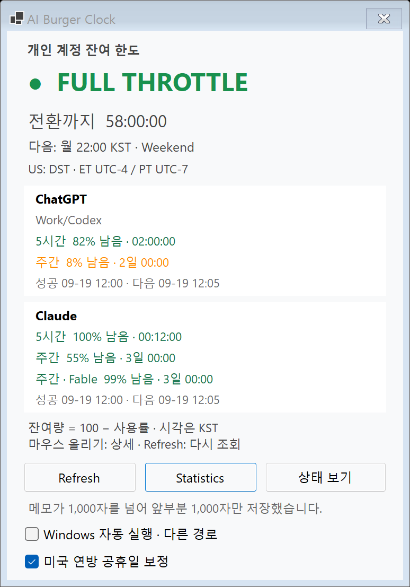

# 2.2.4 — Windows 누적 변경 배포 완료

2026-10-09 KST. #37·#38·#39까지 병합된 main `26ae908`에서 준비한 [PR #40](https://github.com/hydron75/ai-burger-clock/pull/40)을 사용자 승인 뒤 병합했다. 병합 main `670f45af2c41958a0f735215b84786b0429c5a69`를 그대로 publish하여 로컬 `dist/win-x64/AI Burger Clock.exe`를 **2.2.4로 교체하고 최종 검사를 완료**했다. 기존 2.2.3 EXE·dist·소스·DB는 정상 종료와 WAL/SHM 부재 확인 뒤 별도로 백업했다.

Windows 11 x64 / WinForms / net10.0-windows / framework-dependent 단일 EXE, Microsoft.Data.Sqlite 10.0.12와 DB schema 2를 유지한다. Mac 폴더·MACOS_PORT.md·Mac 버전과 공통 원본 27개는 이 준비 PR에서 수정하지 않는다.

## 버전과 변경 범위

**Windows 2.2.4로 배포했다.** 새 Provider·DB 구조·조회 정책을 추가하는 릴리스가 아니라 기존 기능의 표시·메모 처리 개선과 공통화 반영이므로 2.3.0 대신 유지보수 버전으로 정했다. AiBurgerClock.csproj의 Version은 2.2.4, AssemblyVersion·FileVersion은 2.2.4.0이다.

기능 비교 범위는 실제 2.2.3 EXE의 소스 `7772fcbf2ed597ca83907a1ccbd03d68b6605079`부터 준비 전 main `26ae90862a27a00a79d3152a4676bd2cf99ca568`까지다. #40은 버전·통합 검사·기록을 추가하며, Windows에 새로 배포한 내용은 다음과 같다.

| 항목 | 2.2.3 배포본 이후 Windows 변경 |
|---|---|
| 상태·한도 표시 공통화 (#21·#22·#25) | ProviderNames·StatusPanelModel·QuotaPanelModel로 본문·표시 판정을 공유. UI·색·클릭·메뉴 생성은 Windows에 유지 |
| 기록·피드백 공통화 (#23·#25) | UsageMeasurementFactory로 입력 전 시각·상태 캡처, 기록 메뉴와 메모 제한을 공유. FeedbackText 문구를 사용 |
| 공통 검사 정리 (#25·#31) | SharedTestSuite 한 목록을 Windows·Shared.Tests가 한 번 실행. OS 무관 트레이·CLI 검사는 공통으로 옮기고 Windows 아이콘 픽셀·경로 검사는 남김 |
| 통계 문구 (#32·#34) | StatisticsText를 사용. 기존 Windows 기록 위치 문장·화면·계산·기간·표는 유지 |
| 매초 판정 (#33·#36) | StatusTicker로 전환·Provider 알림·아이콘 변경 판정을 공유. RefreshStatus 감싸는 함수·알림 순서·색·초 단위 카운트다운 유지 |
| Windows 경고 로그 (#36) | 중복 Provider는 첫 값을 사용하고 크기 제한 파일에 경고. 정상 입력에는 파일을 만들지 않음 |
| 상세 Tooltip (#37) | 값이 없는 관련 구성요소·사건·사건 ID·마지막 알려진 상태·출처 줄 숨김. 조회·성공 시각과 값 있는 줄의 순서 유지 |
| Provider별 한도 박스 (#38) | ChatGPT·Claude를 흰 박스로 분리, 제목은 박스 밖 기준선, 본문은 상태 카드와 같은 들여쓰기. hover 없음 |
| 메모 잘림 안내 (#39) | 실제로 잘렸을 때 성공 저장 뒤 ‘앞부분 N자만 저장’ 피드백. 1,000자 이하·공백만 정리된 경우는 기존 안내 |

메모는 저장 시 앞뒤 공백을 정리하고, 1,000 UTF-16 단위 이하의 완전한 문자 요소 경계에서 제한한다. 이모지·결합 문자를 반으로 자르지 않으며 경계에 따라 999자 등으로 저장될 수 있다. 기존 입력 중 제한과 달리 전체 입력을 받은 뒤 저장 때 한 번만 정리한다. 기존 기록을 다시 쓰지는 않는다.

한도↔상태 전환과 논리 ClientSize **374×518**, 한도 영역 **342×214**는 그대로다. 표준 두 계정 한도는 스크롤 없이 표시하고 추가 모델별 한도는 내부 스크롤을 유지한다. #38의 한도 PNG 변경은 의도한 변경이며 공통화 자체의 기존 Windows 화면 보존과 구분한다.

### 바꾸지 않은 것

- AccountQuotaClient·Models·Parsers·Policy·Monitor, UsageStore·Phase2Models·AutoStartManager는 2.2.3 소스와 동일하다. CLI 인증·DB schema 2·저장 식별자·데이터 경로·자동 시작 계약을 유지한다.
- 기본 6시간 / 잔여 0% 초과~10% 미만 1시간 / 정확한 0% 15분 / 리셋 전후 15분 구간 5분, 실패 재시도와 기존 Refresh는 그대로다.
- NetworkRefreshScheduler의 5초 대기·1분 연기·유효 연결 없으면 건너뛰기, 공통 HTTP/알림 설정과 QuotaJsonContext는 **이미 2.2.3에 포함**됐다. 이번 신규 변경으로 다시 세지 않는다.
- 실제 main의 한도 Provider는 Codex·Claude 둘이다. Gemini/agy 한도 조회는 이 배포본에 없으며, 공식 Gemini 서비스 상태와 기록·통계는 기존대로 유지한다.
- 크레딧·리셋권 처리·한도 회복 알림·공개 자료 모니터링 일정 변경은 추가하지 않는다. 7b·7c 공통화는 MACOS_UI_PLAN 결정 13에 따라 보류한다.

## PR #40의 변경 파일

기존 수정:

- AiBurgerClock.csproj: Windows 버전 세 값 함께 변경.
- UIRegressionChecks.cs: 한도 모드에서 트레이 기록 메뉴로 긴 메모를 실제 저장하고, 두 박스·잘림 피드백·상태 복귀를 함께 확인하는 native 검사 3건. 제품 동작은 변경하지 않음.
- README.md·CODE_GUIDE.md·BACKLOG.md: 준비 당시 후보/배포본 구분과 배포 후 상태 갱신, 사용법·소스 지도·완료/보류 상태와 이 기록 연결.

신규:

- MAINTENANCE_2_2_4.md: 준비·검증·교체 계획과 승인 후 실제 배포 결과.
- docs/reviews/windows-release-2.2.4-20261009/account-quotas-note-truncated.png: 가짜 응답·임시 DB를 사용한 새 통합 렌더. 개인 기록·계정 화면이 아님.

C# 지도는 루트·Properties 65개(앱 기능 36 + 검사·진단 28 + 명찰 1), Mac 호스트 7개, 공통 검사 입구 1개로 총 73개다. 새 의존성·공통 DLL·상주 도구는 추가하지 않았다. 범위는 **Windows만 변경 + 기록 문서**다. #40의 공통 코드·Mac 코드 변경은 없고 기록·공휴일·시작·종료의 제품 흐름도 바꾸지 않는다. 배포 후 갱신은 이 문서·README·CODE_GUIDE·BACKLOG만이며, EXE는 문서 갱신 전 병합 main 기준을 유지한다.

## 빌드와 검사

Windows 11 Pro x64 10.0.26300 / .NET SDK **10.0.401**에서 실행했다. WinExe의 종료 코드는 build.ps1 또는 직접 Start-Process -Wait -PassThru의 실제 ExitCode로 확인한다. 준비 로그는 로컬 `artifacts/release-2.2.4-preparation-20261009/`, 최종 배포 로그는 `artifacts/release-2.2.4-deployment-20261009/`에 보존한다. self-test는 임시 DB·가짜 HTTP/CLI, smoke는 같은 가짜 응답과 실제 WinForms 메시지 루프를 사용하며 실제 계정 조회·사용자 DB 저장·자동 시작 변경은 하지 않는다. 이후 일반 앱 실행은 기존 실제 서비스·계정 조회를 정상적으로 시작한다.

| 검증 | 실제 결과 | 로그 폴더 |
|---|---|---|
| 기존 dist 2.2.3 self-test | 250,779 assertions, ExitCode 0 | deployed-2.2.3/ |
| 최신 main 26ae908 build.ps1 | 경고 0 / 오류 0, self-test 251,182, ExitCode 0 | baseline/ |
| 2.2.4 후보 40cad7f build.ps1 | 경고 0 / 오류 0, self-test 251,182, ExitCode 0 | candidate/ |
| 최신 main native smoke / PNG | 252 PASS, 실제 ExitCode 0, stderr 0바이트 | baseline/ |
| 2.2.4 후보 native smoke / 통합 PNG | 255 PASS (+3), 실제 ExitCode 0, stderr 0바이트 | candidate/ |
| PNG 비교 | 기존 11쌍 모두 SHA-256 동일. 후보에 통합 화면 1장 추가, 눈으로 확인 | baseline/renders/ ↔ candidate/renders/ |
| 준비 당시 자동 시작 등록 | 기존 dist 절대 경로 + --autostart, Run String·StartupApproved Binary `020000000000000000000000` 읽기 확인. 변경 없음 | 읽기 전용 |
| 준비 검사 후 기존 배포본 실행 | PID 28244, Responding=True, 같은 dist 경로·FileVersion 2.2.3.0·원본 SHA-256 확인 | 준비 당시 교체 없이 --autostart 실행 |
| 병합 main 670f45a build.ps1 -Publish | 경고 0 / 오류 0, 최종 dist self-test 251,182, 실제 ExitCode 0, stderr 0바이트 | deployment/publish.txt · self-test.txt |
| 최종 dist native smoke / PNG | 255 PASS, 실제 ExitCode 0, stderr 0바이트, PNG 12장 | deployment/smoke-test.txt · renders/ |
| 최종 PNG와 준비 후보 비교 | 12쌍 크기 동일. 통계·메모 대화상자는 바이트 동일. 나머지 10쌍은 자동 시작 체크/‘다른 경로’ 안내 영역만 차이 | 차이 bounding box `[47,994,410,1020)` |
| 실제 사용자 DB 보호 | 교체 전 백업과 publish·최종 smoke 후 재시작 전 원본의 SHA-256 동일, WAL/SHM 없음 | 로컬 백업 manifest |
| 최종 자동 시작 등록 | 같은 dist 경로가 새 2.2.4 EXE를 가리킴. Run 종류·값과 StartupApproved 종류·바이트는 백업 전/검사 후/일반 실행 후 모두 동일 | 읽기 전용 |
| 새 배포본 일반 실행 | PID 59276, Responding=True, 실제 dist 경로·FileVersion 2.2.4.0·ProductVersion·SHA-256 확인. 트레이·상태 창 정상은 사용자 확인 | 2026-10-09 08:15:53 KST 프로세스 확인 |

위 표의 `deployment/`는 `artifacts/release-2.2.4-deployment-20261009/`를 뜻한다. 일반 실행 후 프로세스는 유지했다. Computer Use가 실제 트레이 앱의 targetable window를 찾지 못해 에이전트의 일반 화면 직접 캡처는 하지 못했으며, native smoke의 실제 창·트레이 검사와 사용자가 새 2.2.4에서 확인한 정상 표시를 구분해서 기록한다.

### assertion 수 비교

옮긴 검사 그룹은 합산하여 비교한다. 준비 전 main·후보와 최종 2.2.4 dist 실행에서 공통 **250,875** + Windows 전용 **307** = **251,182**다.

| 검사 그룹 | 기존 dist 2.2.3 | main / 2.2.4 후보 / 최종 dist | 차이 |
|---|---:|---:|---:|
| AutoStart | 229 | 229 | 0 |
| Schedule / DST | 242,363 | 242,363 | 0 |
| US holidays | 1,399 | 1,399 | 0 |
| 공식 Provider / HTTP | 96 | 96 | 0 |
| Monitor | 119 | 119 | 0 |
| Tray 합계 | 6,130 | 6,086 공통 + 44 Windows = 6,130 | 0 |
| StatusTicker | — | 63 | +63 |
| SQLite / statistics | 132 | 132 | 0 |
| Holiday metadata | 2 | 2 | 0 |
| quota schemas / CLI 합계 | 192 | 143 + 46 공통 + 3 Windows = 192 | 0 |
| QuotaMonitor | 80 | 80 | 0 |
| PortablePlatform | 37 | 37 | 0 |
| PanelModel | — | 249 | +249 |
| Recording | — | 40 | +40 |
| StatisticsText | — | 20 | +20 |
| Windows warning log | — | 31 | +31 |
| **전체** | **250,779** | **251,182** | **+403** |

줄어든 그룹은 없다. 준비 전 main 대비 후보·최종 dist self-test는 모든 그룹이 동일하다. #40에서 추가한 3건은 self-test가 아닌 native smoke의 UIRegressionChecks에만 들어간다.

### 통합 smoke 확인 항목

- 기존 상태·통계·트레이·공휴일·한도 검사와 #38의 박스/기준선/여백/hover 없음/스크롤 검사.
- #39의 실제 메모 저장 6가지: 1,000 초과, 앞뒤 공백 포함 초과, 공백 제거만으로 정확히 1,000, 한 번만 정규화, 이모지 경계, 정확히 1,000.
- 추가 3건: 한도 모드에서 트레이로 1,005자 메모 저장 → Codex/Claude 박스 유지·상태 카드 숨김 → ‘앞부분 1,000자만 저장’ 안내 → 상태 모드 복귀 후 안내 유지. 실제 실행에서 모두 통과했다.
- `account-quotas-note-truncated.png`는 통합 상태의 가짜 응답 렌더이며 실제 계정·바탕화면 캡처가 아니다.
- baseline과 후보에서 이름이 같은 PNG 11쌍은 **바이트까지 동일**하여 렌더 픽셀도 동일하다. 상태·장애·공휴일·통계·메모·표준/이전값/소진 한도 화면을 포함한다. 후보에만 있는 통합 PNG(전체 창 774×1107 pixels)는 별도로 눈으로 확인했고 두 박스와 하단 잘림 안내가 함께 보였다. 논리 창 크기는 바꾸지 않았다.
- 양쪽 smoke의 BalloonTipShown은 각각 17회였다. 이는 native 알림 이벤트 관측이며 모든 배너의 사용자 화면 노출을 보장하지 않는다. PNG의 자동 시작 ‘다른 경로’ 표시는 테스트 EXE가 bin/검사 스냅샷 경로여서 생긴 것으로 실제 등록을 바꾼 결과가 아니다.
- 최종 dist smoke도 BalloonTipShown 17회, 통합 3건을 포함한 255 PASS였다. 최종 한도/잘림 PNG도 눈으로 확인했다. 준비 후보와 최종 PNG 12쌍의 픽셀 비교에서 통계·메모 대화상자 2쌍은 동일했고, 나머지 10쌍은 자동 시작 영역의 bounding box `[47,994,410,1020)` 밖 픽셀이 모두 동일했다. 후보의 ‘다른 경로’/해제 표시는 최종 dist에서 정상 등록/체크 표시로 바뀌었다. 본문·한도 박스·피드백·창 크기 차이는 없으며 실제 등록값을 수정하지 않았다.

### 미수행과 제한

- 실제 전체 네트워크 단절·재연결·장기간 실시간 대기·실제 계정 소진/리셋·배너 전부의 눈에 보이는 노출은 미수행. 절전 복귀는 미확인(사용자는 절전 모드를 쓰지 않음).
- 에이전트의 실제 재부팅·로그아웃/재로그인 시험은 미수행이다. 해당 자동 시작의 **사용자 확인 결과는 아래 표에 반영**하며 미확인 목록과 구분한다.
- --verify-autostart, 실제 레지스트리 변경, 별도 --check-quotas / --check-providers, Mac build/native smoke, 사용자 기록 내용 조회·직접 DB 무결성 검사는 미수행이다. 승인 후 실제 DB 파일 백업과 원본/복사본 해시 비교는 수행했다.
- 준비 단계에는 사용자의 ‘종료완료’ 회신 뒤 프로세스 부재를 확인하고 두 smoke를 진행한 다음 기존 2.2.3을 다시 실행했다. 실제 교체 단계에는 다시 사용자 ‘앱 종료’ 회신 뒤 사용자 세션의 프로세스 부재와 WAL/SHM 부재를 확인했다. 강제 종료와 WAL 삭제는 하지 않았다.

### 사용자 실제 환경 확인 (2026-10-09 KST)

| 항목 | 확인 결과와 근거 |
|---|---|
| 재부팅 후 자동 시작 | 정상 — 사용자가 #40 배포 승인 메시지에서 확인 |
| 로그아웃 후 재로그인 자동 시작 | 정상 — 같은 사용자 확인 |
| 한도 박스 화면 | 정상 — 같은 사용자 확인 |
| 메모 기록 | 정상 — 같은 사용자 확인 |
| 절전 복귀 | 미확인 — 사용자가 절전 모드를 쓰지 않음 |
| 교체 후 새 2.2.4 트레이와 상태 창 | 정상 — 이번 배포 뒤 사용자 회신 ‘트레이와 상태 창 모두 정상’ |

승인 메시지의 재부팅·재로그인·한도·메모 확인에는 당시 EXE 버전·해시가 별도로 제공되지 않았다. 이를 에이전트가 새 2.2.4로 직접 재부팅·재로그인한 결과로 확대하지 않는다. 마지막 행은 버전·경로·해시를 확인해 실행한 새 2.2.4에 대한 사용자 확인이다.

## Git 기준점과 백업

| 기준 | 전체 커밋 해시 / 상태 |
|---|---|
| 교체 전 배포 2.2.3 EXE 소스 | `7772fcbf2ed597ca83907a1ccbd03d68b6605079` |
| #37 main 병합 | `71a54b9f4f687e37a3fc8211e396a0c439b94836` |
| #38 main 병합 | `df8cba897f7128de49218e8667e3a26763d7b201` |
| #39 병합 후 작업 전 main | `26ae90862a27a00a79d3152a4676bd2cf99ca568` |
| 후보 버전·Windows 통합 검사 / 검증한 코드 HEAD | `40cad7f635619942751eee33c7e0135e30e0e895` |
| 준비 PR #40 최종 HEAD | `05a2e6b19ea56c579ae7abe80f4d57c3edb17e92`. 코드 검증 이후에는 문서·합성 PNG만 추가 |
| #40 main 병합 / 배포 빌드 기준 | `670f45af2c41958a0f735215b84786b0429c5a69`. 2026-10-09 KST 사용자 승인 뒤 병합·main fast-forward 완료 |
| 최종 배포 EXE 소스 | `670f45af2c41958a0f735215b84786b0429c5a69`. ProductVersion도 같은 전체 해시 |
| 배포 후 문서 갱신 | 이 문서·README·CODE_GUIDE·BACKLOG만 갱신. 뒤의 문서 커밋을 EXE 소스로 적거나 다시 publish하지 않음 |

로컬 release 백업을 **2026-10-09 08:08:22 KST**에 완료했다. 실제 프로세스 종료와 WAL/SHM 부재를 확인한 뒤 교체 직전의 파일을 복사했으며, 준비 중 runtime 스냅샷으로 대신하지 않았다.

백업 위치는 `../backups/release-2.2.4-20261009/`, 전체 경로는 `C:/Users/mc_bl/.codex/.chatgpt-projects/g-p-6aa5eb198fd88191b7382af0eb114af4/backups/release-2.2.4-20261009/`다. 새 폴더로 만들었으며 기존 백업을 덮어쓰지 않았다.

| 보관 파일 | 크기 (bytes) | SHA-256 |
|---|---:|---|
| dist-2.2.3.zip — 기존 dist 전체 | 1,560,861 | `C2DD722DF75D134955A11D6E37A68DA0E97003128ED8C78FE75F942AA79E3747` |
| replaced-2.2.3.exe — 기존 배포 EXE | 3,040,491 | `E166448B0BAD9822390F4A0A2EC23471497DA8083EACEC7336578B890C8F286D` |
| source-2.2.3-7772fcb.zip — 기존 EXE 소스의 git archive | 810,788 | `89DE0FCE033E196B600DB8624286CACDD9E2BFB28CE5ED9C68D535F43133E05F` |
| burgerclock.db — 정상 종료 직후 DB 복사 | 61,440 | `3F3297DAF5EC77B00E0CD0A043550DE6266AD818E96F6F6432527B79E511726A` |
| deployed-2.2.4.exe — 새 배포 EXE 보관본 | 3,155,179 | `AF255AE4AD8642F149D07AFB6E819CC18CE3EBD76437182A4413A3204F62C06B` |

`manifest-before-deployment.json`에는 앱 종료·WAL/SHM 부재, 원본 DB/백업 SHA-256, Run 종류·값, StartupApproved 종류·바이트를 보관했다. `manifest-after-deployment.json`에는 최종 EXE·검사·재실행 결과를 보관한다. 두 manifest는 이 앱의 값만 담은 로컬 자료다. dist ZIP의 실제 내용도 기존 EXE 1개임을 확인하고 압축 안의 EXE 해시를 원본과 비교했다.

백업·개인 DB·배포 EXE는 GitHub에 올리지 않는다. 백업 DB와 원본은 복사 직후뿐 아니라 publish와 최종 smoke 후, 일반 앱 재실행 직전에도 같은 해시였다. 사용자 DB 내용은 조회하지 않았다. 새 앱의 정상 조회 뒤에는 원본 캐시가 바뀔 수 있으므로 이 무변경 증거는 재실행 전까지의 것이다. WAL을 삭제하거나 DB를 migration하지 않았다.

## 실행 파일 — 준비 당시 비교본

| 항목 | 2.2.4 **일반 빌드 후보** | 기존 **배포 2.2.3** |
|---|---|---|
| 경로 | bin/Release/net10.0-windows/win-x64/AI Burger Clock.exe | dist/win-x64/AI Burger Clock.exe |
| FileVersion | 2.2.4.0 | 2.2.3.0 |
| ProductVersion | `2.2.4+40cad7f635619942751eee33c7e0135e30e0e895` | `2.2.3+7772fcbf2ed597ca83907a1ccbd03d68b6605079` |
| 크기 | 163,328 bytes | 3,040,491 bytes |
| SHA-256 | `34A164371640E618C382D3D53C749A2C8EB061E62987229A39338FB32EC17D7A` | `E166448B0BAD9822390F4A0A2EC23471497DA8083EACEC7336578B890C8F286D` |

위 후보의 bin EXE는 **폴더 전체가 필요한 apphost**로 최종 단일 EXE가 아니다. 이 표는 준비 당시 기록이며, 현재 배포본은 다음과 같다.

### 최종 배포 EXE (2026-10-09 KST)

| 항목 | 실제 값 |
|---|---|
| 경로 | `C:/Users/mc_bl/.codex/.chatgpt-projects/g-p-6aa5eb198fd88191b7382af0eb114af4/AiBurgerClock/dist/win-x64/AI Burger Clock.exe` |
| FileVersion | `2.2.4.0` |
| ProductVersion | `2.2.4+670f45af2c41958a0f735215b84786b0429c5a69` |
| 크기 | **3,155,179 bytes** |
| SHA-256 | `AF255AE4AD8642F149D07AFB6E819CC18CE3EBD76437182A4413A3204F62C06B` |

## 승인 후 실제 교체와 자동 시작 확인

1. 사용자 승인 뒤 #40 최종 HEAD를 지정해 병합하고 main을 `git pull --ff-only`로 받았다. 병합 소스는 위 `670f45a`다.
2. 사용자 ‘앱 종료’ 회신 뒤 실제 사용자 세션에서 앱 프로세스 부재·WAL/SHM 부재를 확인하고 위 release 백업과 해시 검증을 완료했다. 강제 종료하지 않았다.
3. 깨끗한 병합 main에서 `build.ps1 -Publish`로 **기존 dist 경로**를 교체했다. 최종 EXE의 self-test와 native smoke 종료 코드 0, 버전·소스 해시·크기·SHA를 확인했다.
4. 정상 상태 창 확인을 위해 같은 dist EXE를 이번에는 --autostart 없이 실행했다. 실제 PID·응답·경로·버전·해시를 확인했고, 새 트레이와 상태 창 정상 표시는 사용자가 확인했다. .NET 10 Desktop Runtime x64 요구사항은 유지한다.
5. HKCU Run의 `AI Burger Clock`은 기존 dist 절대 경로와 --autostart를 그대로 가리킨다. **경로는 그대로지만 그 경로의 파일과 실행 프로세스는 새 2.2.4**다.
6. Run의 String 종류·원본 명령과 StartupApproved의 Binary 종류·원본 바이트 `020000000000000000000000`는 백업 전·최종 검사 후·일반 앱 실행 후 동일했다. 체크박스나 레지스트리를 수정하지 않았다. 이번 수동 실행 인자와 로그인 때 사용할 등록 인자는 구분한다.

등록된 원본 명령은 `"C:\Users\mc_bl\.codex\.chatgpt-projects\g-p-6aa5eb198fd88191b7382af0eb114af4\AiBurgerClock\dist\win-x64\AI Burger Clock.exe" --autostart`다. --verify-autostart는 실제 레지스트리를 잠시 바꾸므로 사용하지 않았다. 실제 재부팅·재로그인은 위 사용자 확인과 구분해 기록했다.

## 2.2.3으로 되돌리는 방법

새 앱 정상 종료 → **현재 DB 별도 보존** → release 백업의 replaced-2.2.3.exe를 **원래 dist 경로**로 복사 → FileVersion 2.2.3.0·원본 SHA-256 확인 → 같은 경로에서 --autostart로 실행한다.

2.2.3과 새 2.2.4 모두 schema 2이며 저장 계약이 같으므로 EXE만 되돌릴 때 오래된 DB 백업으로 덮어쓸 필요가 없다. DB까지 되돌리려면 그 뒤 기록 유실을 설명하고 별도 승인받는다. 로그와 데이터 폴더를 통째로 삭제하거나 백업 EXE에서 자동 시작을 재등록하지 않는다.

**#40 병합·release 백업·publish·2.2.4 교체·최종 검사와 정상 실행을 완료했다. 실제 배포 문제는 확인되지 않았으며 2.2.3 복원은 수행하지 않았다.**
