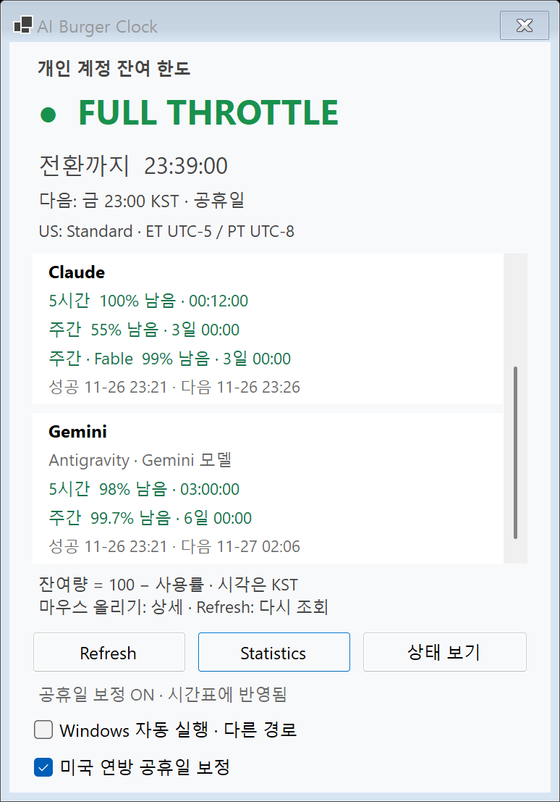
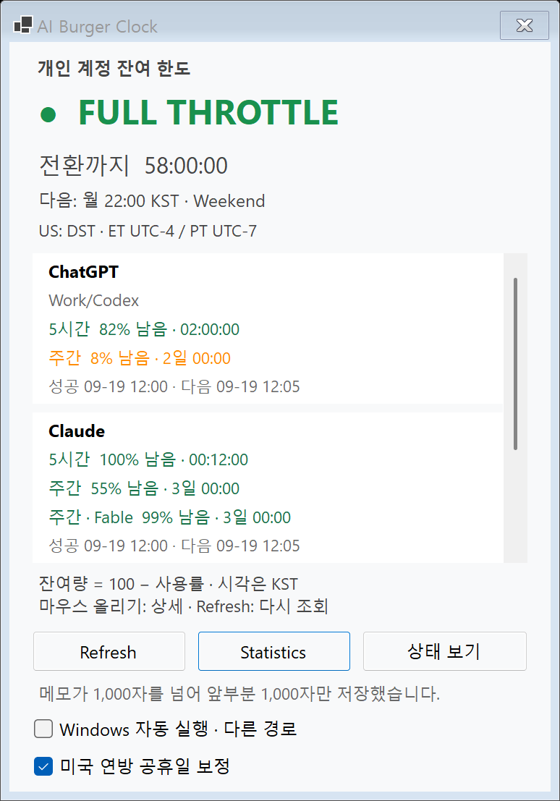

# 2.3.0 — Windows Gemini 한도 배포 준비 (승인 대기)

2026-10-09 KST. #42까지 병합된 main `4c344e28dc3a1dad0e6f26e4993f814e1ffaff7a`에서 `feature/windows-release-2-3-0` 브랜치를 만들었다. Windows 버전 세 값을 2.3.0으로 올리고 빌드·자체 검사·smoke 5회와 설치된 agy의 실제 Gemini 조회를 확인했다.

**아직 배포하지 않았다.** 준비 PR의 병합과 `build.ps1 -Publish`·dist 교체는 사용자 승인 뒤에만 한다. 현재 배포 EXE는 **2.2.4**이며, 검사 후 같은 파일을 `--autostart`로 다시 실행했다. 이 문서는 배포 완료 기록이 아니라 검증 결과와 교체 계획이다.

## 버전과 변경 범위

Version **2.3.0**, AssemblyVersion·FileVersion **2.3.0.0**이다. 새 계정 한도 Provider를 추가하므로 유지보수 버전이 아닌 사용자가 지정한 2.3.0으로 준비한다. Windows 11 x64 / WinForms / net10.0-windows / framework-dependent 단일 EXE, .NET 10 Desktop Runtime x64 요구사항을 유지한다.

실제 배포 2.2.4의 소스 `670f45af2c41958a0f735215b84786b0429c5a69`부터 준비 전 main까지의 Windows 관련 변경은 다음과 같다.

| 항목 | 2.2.4 이후 Windows 변경 |
|---|---|
| Gemini / Antigravity 한도 (#30) | 공식 `agy -p /usage --output-format json --print-timeout 20s`의 `Gemini Models` 그룹에서 5시간·주간 잔여율과 리셋을 읽음. Gemini Apps 전체·Claude/GPT 그룹·크레딧은 제외 |
| 지원 버전·조회 보호 (#30) | 안정 버전 1.3.1 이상·2.0 미만 확인 후 실행. 자식 자동 업데이트 차단, 입력 닫기, 인증 대기 감지, 출력 크기/깊이·시간 제한, 정상 종료·SUCCESS·빈 대화 ID·0턴/0토큰·제공된 비용 0 검증 |
| 한도 화면 (#30) | 공통 QuotaPanelModel을 사용하는 Gemini 박스와 `Antigravity · Gemini 모델` 범위 줄 추가. 상태↔한도 전환·창 374×518·한도 viewport 342×214 logical px 유지, 한도 영역만 세로 스크롤, hover 없음 |
| 자동 조회·캐시 (#30) | Gemini도 기존 Provider별 독립 조회와 실패/이전 값 정책에 연결. enum 끝에 Gemini를 추가해 Codex/Claude 저장 식별자를 유지하며 `AccountQuota.v1.Gemini`만 추가 |
| Windows smoke 보완 (#30) | 비동기 단계 뒤 창이 숨겨져 있을 수 있음을 검사하고 정상 재열기·버튼 선택 가능·실제 Click 발생을 확인. 기존 5초 wait / 25ms poll 유지, 실패 시 창·버튼·조회 상태 진단 보존 |
| 관찰 기록 | 초기 뜻밖의 한도 모드 오류는 원인 미확정으로 BACKLOG에 남김. 뒤의 성공 반복 결과를 원인 확정으로 해석하지 않음 |

#41은 Mac 0.2.1 버전·문서, #42는 Mac의 Gemini 포함 한도 높이·native smoke·문서만 바꿨다. **두 PR은 Windows 신규 변경으로 세지 않는다.** StatusTicker·공통 문구·Provider별 두 박스·메모 잘림 안내는 이미 2.2.4에 포함됐다. 연결 복구 5초/1분 제한은 이미 2.2.3에 포함된 동작이다.

시간표·공휴일·공식 상태 주소·기록/통계·기존 Provider 표시 이름·알림 문구·자동 시작 경로는 유지한다. 조회 정책도 기본 6시간 / 잔여 0% 초과~10% 미만 1시간 / 정확히 0% 15분 / 리셋 ±15분 5분과 기존 실패 재시도를 유지한다. 새 한도 회복 알림·리셋권 사용·결제·DB migration·새 의존성은 추가하지 않는다.

이번 준비 PR의 범위는 **Windows만 변경 + 기록 문서**다. AiBurgerClock.csproj의 버전 외에는 제품·검사 C#를 바꾸지 않는다. 공통 원본 27개·Mac/·MACOS_PORT.md·Mac 버전·AGENTS.md는 수정하지 않는다. #30·#42의 기존 Mac 확인을 이번 Windows 준비에서 새로 실행한 검사로 적지 않는다.

## 변경 파일

기존 수정:

- AiBurgerClock.csproj: Version / AssemblyVersion / FileVersion을 함께 변경.
- README.md·CODE_GUIDE.md·BACKLOG.md: 2.3.0 후보와 배포 2.2.4 구분, 사용법·검사·소스 지도와 이 기록 연결. 초기 smoke 관찰은 계속 유지.
- GEMINI_ANTIGRAVITY_QUOTAS.md: #30 병합·Mac 확인과 이번 준비 기록을 상단에 연결하고 과거 구현/검증 결과와 구분.

신규:

- MAINTENANCE_2_3_0.md: 이번 준비·검증·교체 계획.
- docs/reviews/windows-release-2.3.0-20261009/의 Gemini 한도·메모 잘림 합성 PNG 2장. 실제 계정·바탕화면 캡처가 아니다.

소스 지도는 루트·Properties **68개(기능 36 + 검사·진단 31 + 명찰 1)**, Mac 호스트 7개, 공통 검사 입구 1개로 총 76개다. #30에서 추가한 SmokeDiagnostics.cs도 포함한다. 로컬 실계정 probe·반복 runner는 ignored artifacts에만 두며 앱에 포함하지 않는다.

## 빌드와 자체 검사

.NET SDK **10.0.401**. 검증한 코드 HEAD는 `c15f9bdb7cd9132c2ce1daa7c1f67b2411e6fef0`이다. `build.ps1`을 실행해 **경고 0 / 오류 0**, 자체 검사 **251,377 assertions**를 확인했다. 기존 dist 2.2.4와 후보도 각각 `Start-Process -Wait -PassThru`로 직접 실행해 실제 ExitCode **0**을 확인했다.

| 검사 그룹 | 기존 dist 2.2.4 | 후보 2.3.0 | 차이 |
|---|---:|---:|---:|
| Gemini 파서/정책 | — | 85 | +85 |
| Gemini CLI 보호/버전/프로토콜 | — | 78 | +78 |
| 한도 Monitor/재시작/취소 | 80 | 98 | +18 |
| 경로/IANA/표시/CLI 후보 | 37 | 39 | +2 |
| PanelModel | 249 | 261 | +12 |
| 나머지 공통 검사 | 250,509 | 250,509 | 0 |
| **공통 합계** | **250,875** | **251,070** | **+195** |
| **Windows 전용** | **307** | **307** | **0** |
| **전체** | **251,182** | **251,377** | **+195** |

감소한 그룹은 없다. Windows 전용 307건은 자동 시작 229 + 트레이 픽셀 44 + CLI 경로 3 + 경고 로그 31이다. 버전 변경 자체로 assertion은 늘지 않았고 #42도 공통 검사 수를 바꾸지 않았다. 이번에는 Shared.Tests를 별도로 실행하지 않았다. 공통 251,070건은 Windows SelfTest가 SharedTestSuite를 한 번 실행한 결과다.

## smoke 5회와 화면 확인

실행 중이던 배포 앱을 사용자가 정상 종료한 뒤 프로세스 부재를 확인했다. 후보 Release EXE를 **5회 순차 실행**했으며 재시도·실패 제외·timeout 증가 없이 결과를 보존했다. 각 실행은 임시 DB·가짜 HTTP/CLI와 실제 WinForms 메시지 루프를 사용한다. `--verify-autostart`는 사용하지 않았다.

| 회차 | 실제 ExitCode | smoke PASS | 소요 시간 |
|---|---:|---:|---:|
| 1 | 0 | 293 | 31.70초 |
| 2 | 0 | 293 | 31.56초 |
| 3 | 0 | 293 | 31.61초 |
| 4 | 0 | 293 | 31.63초 |
| 5 | 0 | 293 | 31.66초 |
| **실패** | **0/5회** | | |

- 상태·트레이·통계·공휴일·한도·기록·메모 잘림 통합 검사가 모두 통과했다. Gemini 세 번째 박스, 범위 설명, 정상/이전 값/미설치/형식 불일치, 스크롤과 상태 복귀를 확인했다.
- 합성 Gemini 10초 지연은 5회 모두 **10.02~10.05초**였다. UI heartbeat 48~49회, 트레이·상태 카운트다운 각각 12종, 메뉴 열기·창 숨김/재열기·다른 Provider 독립 완료·중복 Gemini 조회 없음이 통과했다. 이는 합성 응답성 검사이며 실제 agy의 장기 동작 보장은 아니다.
- BalloonTipShown은 매회 17회다. native 이벤트 관측이지 모든 배너의 사용자 화면 노출 보장은 아니다.
- 이번 두 PNG를 직접 열어 Gemini 박스의 5시간·주간·조회 행과 내부 스크롤, 한도 모드에서 메모 잘림 안내를 확인했다. 자동 시작 ‘다른 경로’는 bin 후보와 등록된 dist 경로가 다르기 때문이며 등록을 바꾼 결과가 아니다. 이번에는 배포 2.2.4와 새 PNG의 전체 픽셀 비교를 다시 수행하지 않았다. #30의 전후 비교는 [기존 기록](GEMINI_ANTIGRAVITY_QUOTAS.md)으로 구분한다.





### 초기 간헐 오류와 남긴 진단

초기 `UI labels attempted time explicitly` 오류는 2회이며, 뜻밖의 한도 모드가 기록된 것은 두 번째 1회다. 첫 번째 모드는 미기록이고 **원인은 여전히 미확정**이다. 별도 숨긴 창 클릭 전제 보완을 이 초기 오류의 확정 원인으로 적지 않는다. 이번 0/5 결과도 재발하지 않는다는 보장은 아니다.

SmokeDiagnostics.cs와 실패 직전/실패 시점의 `DIAG:` JSON 기록을 유지했다. 이번 로그는 `artifacts/release-2.3.0-preparation-20261009/smoke/run-01`~`run-05`의 `smoke.txt`·`smoke-errors.txt`·PNG와 `smoke/results.csv`다. 재발 시 표준 오류도 별도 파일로 리디렉션해 창 모드·포커스·버튼 선택 상태·실제 Click 스택·Provider별 가짜/monitor 조회와 경과 시간을 확인한다. `--report-directory`만으로 진단이 저장되지는 않는다. [관찰 항목](BACKLOG.md#관찰-windows-smoke의-뜻밖의-한도-모드-원인-미확정)을 계속 유지한다.

## 이 PC의 agy 실제 조회

2026-10-09 **12:18:19 KST** 응답 수신. 설치 경로 `C:/Users/mc_bl/AppData/Local/agy/bin/agy.exe`, `--version` **1.3.2 / ExitCode 0**이다.

로컬 probe가 **후보 DLL의 AccountQuotaClient.ReadAsync(Gemini)만 1회** 호출했다. 전체 `--check-quotas`는 Codex·Claude도 조회하므로 실행하지 않았다. 사용자 DB/store·다른 Provider·트레이 context를 생성하지 않았다. 앱/probe가 인증 토큰·쿠키 파일을 직접 읽거나 비공개 endpoint를 호출하지 않았으며, 설치·로그인·인증 갱신·업데이트·영구 설정 변경도 요청하지 않았다. 인증은 기존 로그인 상태의 공식 CLI가 관리한다.

- 실제 조회 **8.37초 / probe ExitCode 0**.
- `gemini-5h`·`gemini-weekly` **두 창** 수신, 잔여율 범위와 리셋 시각 제공 확인.
- 앱의 정상 CLI 종료·SUCCESS·빈 대화 ID·0턴·필수 및 추가 토큰 0·제공된 비용 0 응답 검증을 통과했다.
- raw JSON·계정 수치·리셋 값·OAuth/인증 정보는 문서나 GitHub에 게시하지 않는다. ignored `live-gemini.txt`도 버전·검증 여부·수신 시각·소요 시간만 담는다.
- 기존 승인된 **hooks/MCP 설정 격리 제한**은 그대로다. 기존 설정을 읽거나 초기화할 수 있으며, 이 성공을 완전 격리·모든 실행의 절대 비소비·서버 데이터 생성 시각/신선도 보장으로 확대하지 않는다.

전체 로그는 ignored `artifacts/release-2.3.0-preparation-20261009/`에 둔다. build.txt, self-test.txt, 기존/후보 self-test 출력, live-gemini.txt, probe 빌드·오류 로그와 smoke 실행별 기록을 보존했다. 검사 뒤 배포 2.2.4를 다시 실행하면 그 기존 앱의 정상 공식 상태·계정 조회가 시작될 수 있으며, 이는 이번 Gemini 단독 probe와 별개다.

## Git 기준점과 실행 파일

| 기준 | 전체 커밋 해시 / 상태 |
|---|---|
| 현재 배포 2.2.4 소스 | `670f45af2c41958a0f735215b84786b0429c5a69` |
| #30 main 병합 | `4695a55dc00dd90e95a93aa9ba6f80200fb23a0c` |
| 초기 smoke 관찰 문서 | `7e1342d48e194d942441a783299d807b1df1e792` |
| #42 병합 / 준비 작업 전 main | `4c344e28dc3a1dad0e6f26e4993f814e1ffaff7a` |
| 버전 변경 / 실제 검증한 코드 HEAD | `c15f9bdb7cd9132c2ce1daa7c1f67b2411e6fef0` |
| 준비 PR 최종 HEAD | PR에서 확인. 코드 검증 뒤 문서·합성 PNG만 추가하며 최종 배포 소스와 구분 |
| 준비 PR 병합 / 최종 배포 EXE 소스 | **승인 대기·미정.** 병합 뒤 실제 main 전체 해시로 채움 |
| release 백업·publish·교체 | **미수행.** 승인 전에는 실행하지 않음 |

| 항목 | 검증한 2.3.0 bin 후보 | 현재 배포 2.2.4 |
|---|---|---|
| 경로 | bin/Release/net10.0-windows/win-x64/AI Burger Clock.exe | dist/win-x64/AI Burger Clock.exe |
| FileVersion | 2.3.0.0 | 2.2.4.0 |
| ProductVersion | `2.3.0+c15f9bdb7cd9132c2ce1daa7c1f67b2411e6fef0` | `2.2.4+670f45af2c41958a0f735215b84786b0429c5a69` |
| 크기 | 163,328 bytes | 3,155,179 bytes |
| SHA-256 | `C26313BEBA64DE5A50E0A60C57974050BD73835F096E3486E21DD12BD8701257` | `AF255AE4AD8642F149D07AFB6E819CC18CE3EBD76437182A4413A3204F62C06B` |

bin 후보는 폴더 전체가 필요한 apphost이며 **최종 단일 EXE가 아니다.** 승인 뒤 병합된 main에서 publish한 최종 파일의 경로·두 버전·크기·SHA-256과 소스 해시는 별도로 채워야 한다. 현재 dist 해시는 작업 전후 동일하다.

## 승인 후 백업·교체 계획

아래는 **계획이며 아직 수행하지 않았다.** 준비 단계의 프로세스 종료와 WAL/SHM 부재 확인을 교체 시점의 확인으로 대신하지 않는다.

1. 사용자가 준비 PR 병합·교체를 승인하면 PR의 승인 HEAD를 병합하고 main에서 `git pull --ff-only` 한다. 깨끗한 작업 트리·병합 main 전체 해시를 기록한다.
2. **기존 앱 정상 종료 → 실제 프로세스 부재 → 사용자 DB의 활성 WAL 없음 확인.** WAL/SHM이 남으면 삭제하거나 DB 본체만 복사하지 않고 원인을 확인해 교체를 보류한다. 앱이 켜진 상태의 준비 스냅샷을 release 백업으로 쓰지 않는다.
3. `../backups/release-2.3.0-<교체일 YYYYMMDD>/`에 새 release 폴더를 만든다. 전체 기준 위치는 `C:/Users/mc_bl/.codex/.chatgpt-projects/g-p-6aa5eb198fd88191b7382af0eb114af4/backups/`다. 이미 있으면 별도 폴더로 보존하며 덮어쓰지 않는다.
   - `dist-2.2.4.zip`: 교체 직전 dist 전체.
   - `replaced-2.2.4.exe`: 기존 EXE. 위 SHA-256과 대조.
   - `source-2.2.4-670f45a.zip`: 실제 기존 EXE 소스 커밋의 git archive.
   - `burgerclock.db`: 정상 종료 직후 사용자 DB 복사. 원본/복사본 해시 확인, 내용 조회·migration 없음.
   - 교체 전 manifest: KST 시각·프로세스 부재·WAL/SHM 상태·버전/해시·자동 시작의 Run/StartupApproved 종류와 값. 백업·개인 DB·EXE는 GitHub에 올리지 않음.
4. 승인된 병합 main에서 **`build.ps1 -Publish`** 실행. 기존 `dist/win-x64/AI Burger Clock.exe` 경로를 유지한다. 실패하면 아래 2.2.4 복원 절차를 적용한다.
5. 최종 dist의 FileVersion **2.3.0.0**·ProductVersion **2.3.0+실제 소스 해시**·크기·SHA-256, self-test와 native smoke 실제 ExitCode 0을 확인한다. Gemini 박스·메모 안내와 상태 복귀를 다시 확인하며 초기 오류가 재발하면 진단을 남기고 배포를 완료했다고 적지 않는다.
6. 자동 시작 등록을 읽기 전용으로 재확인한다. 같은 dist 경로가 **그 경로의 새 2.3.0 EXE**를 가리키는지, Run 명령의 `--autostart`와 StartupApproved 종류·바이트가 전후 같은지 확인한다. 후보/백업 EXE에서 자동 시작을 다시 등록하거나 체크박스를 조작하지 않는다.
7. 같은 dist 경로로 새 앱을 실행하고 실제 프로세스 경로·버전·응답과 트레이·상태/한도 창을 확인한다. 최종 EXE 보관본·교체 후 manifest·실제 백업 경로와 해시·사용자 확인/미확인을 이 문서에 기록한다. 이번 준비 단계의 결과로 대체하지 않는다.

### 준비 당시 자동 시작 읽기 확인

HKCU Run의 `AI Burger Clock`은 String 종류이며 명령은 아래와 같다.

```text
"C:\Users\mc_bl\.codex\.chatgpt-projects\g-p-6aa5eb198fd88191b7382af0eb114af4\AiBurgerClock\dist\win-x64\AI Burger Clock.exe" --autostart
```

StartupApproved는 Binary, `020000000000000000000000`이다. 현재는 같은 경로의 **2.2.4**를 가리킨다. 교체 뒤 같은 경로에 2.3.0이 있을 때 버전·실행 프로세스까지 확인해야 한다. 이번에는 등록값을 변경하지 않았다.

## 2.2.4로 되돌리는 방법 (계획)

새 앱 정상 종료 → **그 시점의 현재 DB 별도 보존** → release 백업의 `replaced-2.2.4.exe`를 원래 dist 경로에 복사 → FileVersion 2.2.4.0·ProductVersion·원본 SHA-256 확인 → 같은 경로에서 `--autostart`로 실행 → 프로세스·등록 경로·트레이 확인.

두 버전 모두 schema 2이며 Gemini metadata는 별도 key다. 기존 2.2.4는 자기 Codex/Claude key만 읽어 Gemini key를 무시하므로 **EXE 복원에 오래된 DB 덮어쓰기는 필요하지 않은 구조**다. 이는 코드상 호환 판단이며 실제 새 배포본에서의 복원 시험은 미수행이다. DB까지 되돌리면 이후 사용자 기록이 사라질 수 있으므로 별도 설명·승인 없이 복원하지 않는다. WAL·로그·데이터 폴더를 삭제하거나 백업 경로에서 자동 시작을 재등록하지 않는다.

## 미수행과 남은 승인

- **PR 병합·release 백업·publish·dist 교체·최종 단일 EXE 검증·실제 복원 시험은 미수행**이며 사용자 승인 대기다.
- 실제 전체 네트워크 단절·재연결, 새 버전의 재부팅·재로그인·절전 복귀·장시간 자동 조회·실제 소진/리셋·모든 hooks/MCP 환경·모든 플랜/agy 버전·배너 시각 노출은 미수행이다.
- 이번 Mac 빌드/native smoke와 별도 Shared.Tests 실행, 사용자 DB 내용/기록 조회·레지스트리 변경·전체 Provider 실계정 probe는 미수행이다.
- 2.2.4의 기존 사용자 재부팅·재로그인·한도·메모 확인 결과를 새 2.3.0 실제 환경 확인으로 옮겨 적지 않는다.
- 추가 진단과 BACKLOG 관찰은 유지한다. **준비 PR 게시와 위 확인까지만 진행하며 병합·교체하지 않는다.**
