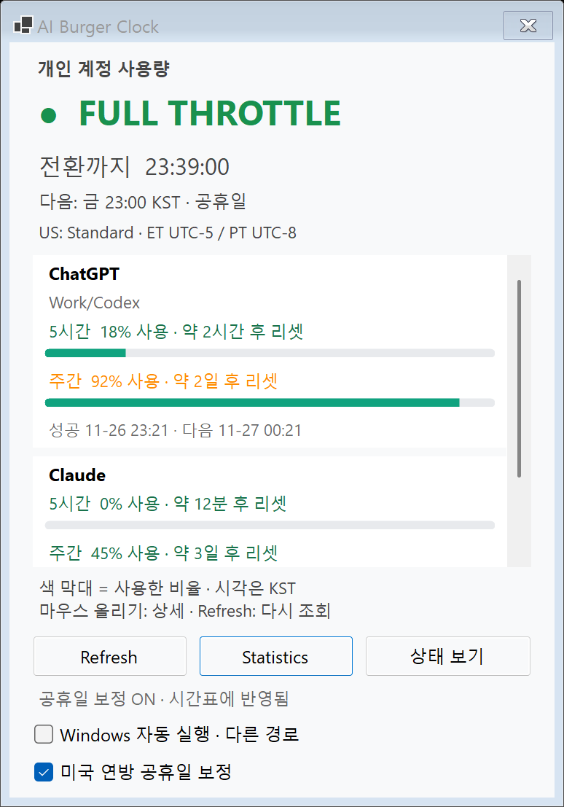
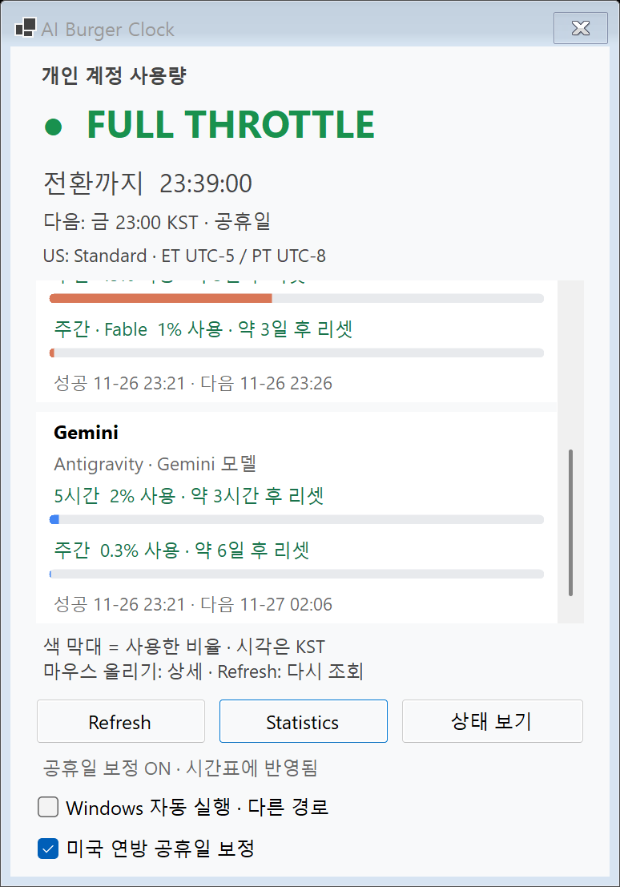
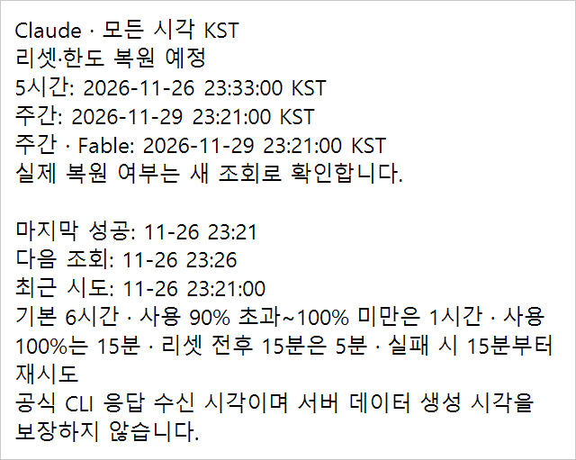

# AI Burger Clock 2.4.0 — Windows 사용량 표시 배포

기록일: **2026-10-10 KST**. 상태: **#47 병합·release 백업·2.4.0 배포 교체·최종 검사 완료**.

사용자 요청에 따라 #46이 병합된 main에서 Windows 2.4.0 후보를 만들고 빌드·자체 검사·smoke 5회를 실행했다. 이후 사용자 승인으로 #47의 Draft를 해제해 병합하고 main을 fast-forward했다. 정상 종료·WAL/SHM 부재 확인과 기존 2.3.0 백업 뒤 **병합 main `296f52492de8e0529df853b2e06a7640887ccc03`에서 `build.ps1 -Publish`**를 실행했다. 현재 `dist/win-x64/AI Burger Clock.exe`는 **2.4.0**이다. 준비 후보 검사와 최종 단일 EXE 검사·사용자 화면 확인은 아래에서 구분한다.

## 버전과 변경 범위

Version **2.4.0**, AssemblyVersion·FileVersion **2.4.0.0**이다. 사용자가 지정한 버전이며 Windows 11 x64 / WinForms / net10.0-windows / framework-dependent 단일 EXE와 .NET 10 Desktop Runtime x64 요구사항을 유지한다.

교체 전 배포 2.3.0의 소스 `019d3f3de99ae796801d6c6b8e7d000f1470e627`부터 준비 전 main까지의 Windows 관련 변경은 다음과 같다.

| 항목 | 2.3.0 이후 Windows 변경 (#45) |
|---|---|
| 사용량 화면 | 제목 `개인 계정 사용량`, 사용률 행과 막대. 0%는 빈 막대, 100%는 가득 찬 막대. 원본 사용률은 공통 QuotaPanelModel에서 전달 |
| 대표색 | ChatGPT `#10A37F`, Claude `#D97757`, Gemini `#4285F4`. 이전/리셋 경과 값의 막대는 회색. 주의·위험 톤 판정은 유지 |
| 간략 리셋 | 5시간 창은 시간·분, 주간은 일·시간. 마지막 단위를 올림·이월한 뒤 앞뒤 0 단위를 모두 생략. 1분 미만·미제공·경과 처리 유지 |
| Provider 상세 | Provider별 하나의 상세에 모든 창의 정확한 KST 리셋·한도 복원 예정 시각, 조회 상태·오류·정책·조회 범위를 표시. 화면의 사용률은 중복 나열하지 않음 |
| Windows 팝업 | 흰색·320 DIP 고정 폭·자동 줄바꿈·내용에 따른 높이·포인터 근처 배치·화면 경계 보정. 긴 상세는 세로 스크롤. Provider를 벗어남·창 숨김·30초 만료 시 닫힘 |
| 표시 문구 | 조회 안내를 `사용 90% 초과~100% 미만은 1시간`, `사용 100%는 15분`으로 통일. 실제 조회 주기·재시도 계산은 변경하지 않음 |
| 회귀 검사·공개 기록 | 공통 사용량·시간·상세 검사와 Windows 막대/팝업 검사를 추가. 공개 기록은 합성 데이터 또는 일반화한 결과만 사용 |

Provider별 비클릭 박스, 상태↔한도 전환, 창 크기 **374×518 logical px**는 유지한다. 막대로 늘어난 내용은 기존 한도 영역 안에서 세로로 스크롤한다. 시간표·공휴일·공식 상태·트레이 문자/색/알림·기록·통계·CLI 조회 계약·네트워크 복구·자동 시작·SQLite schema 2는 유지한다. 리셋 예정 시각만으로 실제 복원을 가정하지 않고 새 조회로 확인한다.

#43은 Mac 0.3.0 버전·문서, #46은 Mac 0.4.0 사용량 UI·smoke·문서 후속이다. **Windows 신규 동작으로 세지 않는다.** #46의 BACKLOG에 추가된 **요금제 표시·Mac CLI 설치 경로 지정 후보는 둘 다 보류**로 유지하며 이번에 구현하지 않는다. 기존 #30 초기 smoke의 뜻밖의 한도 모드 관찰·진단도 유지한다.

준비 PR #47 범위는 **Windows만 변경 + 기록 문서**다. AiBurgerClock.csproj 버전 외에는 제품·검사 C#를 바꾸지 않았다. 공통 원본 27개·Mac/·MACOS_PORT.md·Mac 버전·AGENTS.md는 수정하지 않았다. #45는 양쪽 OS 확인 뒤 이미 main에 병합됐으며 [Mac 최종 확인](https://github.com/hydron75/ai-burger-clock/pull/45#issuecomment-6094538599)을 이번 Windows 배포에서 새로 수행한 검사로 적지 않는다. 병합 뒤 갱신은 이 문서·README·CODE_GUIDE·BACKLOG·QUOTA_USAGE_UI의 배포 기록뿐이다.

## 변경 파일

기존 수정:

- AiBurgerClock.csproj: Version / AssemblyVersion / FileVersion을 함께 변경.
- README.md·CODE_GUIDE.md·BACKLOG.md: 2.4.0 준비/최종 검사·사용법·소스 지도·배포 상태와 이 기록 연결. 2.3.0 실제 배포 기록과 #46 보류 후보 유지.
- QUOTA_USAGE_UI.md: #45 최종 Mac 확인·main 병합과 이번 준비 기록을 상단에 연결. 이전 보류·실패·검증 경과는 당시 기록으로 보존.

신규:

- MAINTENANCE_2_4_0.md: 준비 검증·기준점·승인한 교체/복원 절차와 배포 결과.
- docs/reviews/windows-release-2.4.0-20261010/의 한도 2장·Provider 상세 1장. **합성 데이터**이며 실제 계정 화면이나 바탕화면 캡처가 아니다.

소스 지도는 루트·Properties **72개(기능 38 + 검사·진단 33 + 명찰 1)**, Mac 호스트 7개, 공통 검사 입구 1개로 총 80개다. #45의 QuotaBalanceBar.cs·QuotaDetailPopup.cs·QuotaPresentationTests.cs·QuotaToolTipUiChecks.cs를 포함한다. 이번 준비 PR이 새 C# 파일을 추가한 것은 아니다.

## 준비 당시 빌드와 자체 검사

.NET SDK **10.0.401**. 실제 검증한 코드 HEAD는 `867c62151fae20946de64ce964ebf6540508b19b`이다. `build.ps1`을 실행해 **경고 0 / 오류 0**, Windows 자체 검사 **251,451 assertions / ExitCode 0**을 확인했다. 실제 기존 dist 2.3.0도 `--self-test`로 실행해 **251,377 assertions / ExitCode 0**을 확인했다. 두 결과 모두 `Start-Process -Wait -PassThru`의 실제 프로세스 ExitCode이며 `$LASTEXITCODE`로 대신하지 않았다.

| 검사 그룹 | 기존 dist 2.3.0 | 후보 2.4.0 | 차이 |
|---|---:|---:|---:|
| quota usage/countdown/provider detail | — | 74 | +74 |
| 나머지 공통 검사 | 251,070 | 251,070 | 0 |
| **공통 합계** | **251,070** | **251,144** | **+74** |
| **Windows 전용** | **307** | **307** | **0** |
| **전체** | **251,377** | **251,451** | **+74** |

공통 그룹별 실제 출력은 새 그룹 외에는 모두 같고 감소한 그룹은 없다. Windows 307건은 자동 시작 229 + 트레이 픽셀/표시 이름 44 + Windows CLI 경로 3 + 경고 로그 31이다. 버전 변경 자체로 assertion은 늘지 않는다. 공통 251,144건은 Windows SelfTest가 SharedTestSuite를 한 번 실행한 결과다. 이번 준비에서는 Shared.Tests를 별도로 실행하지 않았다.

## 준비 당시 smoke 5회와 합성 화면

사용자가 기존 테스트 앱을 정상 종료한 뒤 프로세스 부재를 확인했다. 후보 Release EXE를 **5회 순차 실행**했다. 임시 DB·가짜 HTTP/CLI·실제 WinForms 메시지 루프를 사용하며 `--verify-autostart`는 실행하지 않았다. 실패 제외·숨긴 재시도·대기 시간 증가 없이 실행별 stdout/stderr·PNG와 전체 결과를 보존했다.

| 회차 | 실제 ExitCode | smoke PASS | 소요 시간 |
|---|---:|---:|---:|
| 1 | 0 | 387 | 32.36초 |
| 2 | 0 | 387 | 32.11초 |
| 3 | 0 | 387 | 31.96초 |
| 4 | 0 | 387 | 31.89초 |
| 5 | 0 | 387 | 32.10초 |
| **실패** | **0/5회** | | |

- 상태·트레이·통계·공휴일·한도·기록·메모 잘림 통합 검사, 사용률 막대·색·공통 상세·접근성·고정 폭/줄바꿈·포인터 배치·닫힘·DPI·긴 상세 스크롤 검사가 통과했다.
- 합성 Gemini 10초 지연은 **10.02~10.04초**, UI heartbeat **48~49회**, 트레이·상태 카운트다운 각각 **11~12종**이다. 조회 대기 중 메뉴 열기·창 숨김/재열기·다른 Provider 독립 완료·중복 조회 없음이 통과했다. 실제 agy의 장기 동작 보장은 아니다.
- BalloonTipShown은 매회 **17회**다. native 이벤트 관측이지 실제 화면의 모든 배너 노출 확인은 아니다.
- 첫 회의 PNG를 직접 열어 사용률 막대, 간략 리셋, Gemini 범위, 한도 내부 스크롤, 흰색 줄바꿈 상세를 확인했다. 자동 시작 ‘다른 경로’는 bin 후보와 등록된 dist 경로가 다른 표시이며 등록을 변경한 결과가 아니다.
- 이번 준비에서는 2.3.0 대비 전체 픽셀 비교를 다시 실행하지 않았다. #45의 비한도 PNG 8개 동일·의도한 한도 화면 변경은 [기존 전후 검증](QUOTA_USAGE_UI.md#화면-비교)과 구분한다. 이후 변경은 버전·문서이며 새로운 UI 변경을 더하지 않는다.
- 기존 원인 미확정 smoke 관찰과 SmokeDiagnostics의 `DIAG:` 기록을 계속 남긴다. 이번 실패 0/5회가 초기 오류의 원인 확정·해결 보장은 아니다. stderr의 정상 진단 출력도 보존하며 오류 파일이 비었다고 적지 않는다.







로컬 증거: ignored `artifacts/release-2.4.0-preparation-20261010/`의 build.txt, self-test.txt·self-test-errors.txt, dist-2.3.0-self-test.txt·errors, smoke/run-01~run-05의 smoke.txt·smoke-errors.txt·PNG, smoke/results.csv. 공개 저장소에는 위 합성 PNG만 넣고 원본 로그·개인 DB·계정 화면은 올리지 않는다.

## 준비 당시 실제 계정 화면 확인

후보 **2.4.0 bin 앱을 일반 실행**하고 프로세스 경로·응답을 확인했다. 기존 로그인 상태에서 실제 계정이 표시되는 한도 화면의 **ChatGPT·Claude·Gemini 사용량 막대·간략 리셋·Provider 상세 정상은 사용자 확인**이다. 흰 배경·고정 폭·줄바꿈·포인터 근처 표시·포인터 이동 시 닫힘을 포함한 확인 요청에 사용자가 ‘정상’으로 회신했다.

화면 조작 도구에는 창·트레이가 노출되지 않아 에이전트가 실제 계정 화면을 직접 읽은 것은 아니다. 실제 CLI 단독 probe·서버 응답 원문 검사나 데이터 생성 시각/신선도 검증도 이번에 새로 수행하지 않았다. 사용자 화면 확인, 위 합성 UI 검사, 프로세스 응답을 서로 다른 근거로 기록한다. 실제 계정의 요금제·사용률·리셋 시각·식별자·화면 캡처는 게시하지 않는다.

확인 뒤 사용자가 후보 앱을 정상 종료했고, 프로세스 부재를 확인한 다음 **기존 2.3.0 dist EXE를 `--autostart`로 다시 실행**했다. 배포 파일과 자동 시작 등록은 교체하지 않았다. 일반 앱 실행의 정상 조회는 한도 캐시를 갱신할 수 있으므로 사용자 DB가 이 과정 전체에서 무변경이었다고 주장하지 않는다.

## 병합된 main의 최종 배포 검사

사용자 승인 뒤 **2026-10-10 16:01:35 KST**에 #47의 Draft를 해제하고 승인 HEAD `a51c6d04ef217a2b2f12aecf652001fd03071bf9`를 지정해 병합했다. main으로 전환해 `git pull --ff-only` 했으며, 깨끗한 병합 main `296f52492de8e0529df853b2e06a7640887ccc03`에서 `build.ps1 -Publish`를 실행했다. 준비 apphost나 이후 문서 커밋에서 배포하지 않았다.

.NET SDK **10.0.401**, 빌드·publish **경고 0 / 오류 0**이다. 최종 **dist 단일 EXE**의 자체 검사는 **251,451 assertions / 실제 ExitCode 0**이다. 공통 **251,144 + Windows 전용 307**으로 준비 후보와 같고 교체 전 배포 2.3.0보다 **+74**다. `Start-Process -Wait -PassThru`로 최종 프로세스의 ExitCode를 확인했다.

같은 최종 EXE의 `--smoke-test --report-directory`를 **1회** 실행해 **387 PASS / 실제 ExitCode 0 / 32.86초**를 확인했다. 준비 5회와 별도 실행이며 실패 제외·재시도·대기 시간 증가는 없다. 상태·통계·공휴일·트레이 알림 요청·한도/기록/메모 잘림 통합·사용률 막대·고정 폭 상세·닫힘·DPI·긴 상세 스크롤 검사가 통과했다. 합성 Gemini 지연 **10.04초**, UI heartbeat **49회**, 트레이·상태 카운트다운 각각 **13종**, BalloonTipShown **17회**를 관측했다. 실제 agy 장기 동작·배너 시각 노출 확인으로 확대하지 않는다.

최종 PNG도 직접 열어 세 Provider의 사용률 막대·간략 리셋·한도 내부 스크롤과 흰색 줄바꿈 상세를 확인했다. 모두 **합성 데이터**다. 이번에는 2.3.0과의 전체 픽셀 비교를 새로 실행하지 않았다. 실제 계정 화면의 최종 사용자 확인은 아래 일반 실행 절에 별도로 기록한다.

로컬 로그는 ignored `artifacts/release-2.4.0-deployment-20261010/`의 `publish.txt`, `final-self-test.txt`·`final-self-test-errors.txt`, `final-smoke/smoke.txt`·`smoke-errors.txt`·PNG, `validation.json`·`completion.json`에 보존했다. 정상 `DIAG:`도 표준 오류에 남겼으며 오류 파일이 비었다고 적지 않는다. 초기 뜻밖의 한도 모드 원인은 여전히 미확정이고 진단·BACKLOG 관찰은 유지한다. `--verify-autostart`·별도 Shared.Tests·Mac 검사는 이번 배포에서 실행하지 않았다.

## Git 기준점과 실행 파일

| 기준 | 전체 커밋 해시 / 상태 |
|---|---|
| 기존 배포 2.3.0 EXE 소스 | `019d3f3de99ae796801d6c6b8e7d000f1470e627` |
| #45 최종 HEAD / Mac 기대값 확인 | `e85a439669caa4e32fdf177b9679bc449d126d75` |
| #45 main 병합 | `7a72174bae5ca17e8d9643d9410dacbc2071693d` |
| #46 병합 / 준비 작업 전 main | `69716e46cd9429dd648424632ea0cb15d8618e44` |
| 버전 변경 / 실제 검증한 PR 코드 HEAD | `867c62151fae20946de64ce964ebf6540508b19b` |
| 준비 PR #47 최종 HEAD | `a51c6d04ef217a2b2f12aecf652001fd03071bf9`. 위 코드 검증 뒤 문서·합성 PNG만 추가 |
| #47 main 병합 / 최종 배포 EXE 소스 | `296f52492de8e0529df853b2e06a7640887ccc03`. 2026-10-10 KST 사용자 승인 뒤 병합·main fast-forward 완료 |
| 배포 후 문서 갱신 | 이 문서·README·CODE_GUIDE·BACKLOG·QUOTA_USAGE_UI만 갱신. 뒤의 문서 커밋을 EXE 소스로 적거나 다시 publish하지 않음 |

| 항목 | 준비 당시 검증한 2.4.0 bin 후보 | 교체 전 배포 2.3.0 |
|---|---|---|
| 경로 | bin/Release/net10.0-windows/win-x64/AI Burger Clock.exe | dist/win-x64/AI Burger Clock.exe |
| FileVersion | `2.4.0.0` | `2.3.0.0` |
| ProductVersion | `2.4.0+867c62151fae20946de64ce964ebf6540508b19b` | `2.3.0+019d3f3de99ae796801d6c6b8e7d000f1470e627` |
| 크기 | 163,328 bytes | 3,269,867 bytes |
| SHA-256 | `C02350DD20D7D75F86F9AD98736547B45951A8537E3CE830E35266E03CD1BE1B` | `69893DBF1E971DFDA10CDE8B72BC89F11982758AC49DCC0D46D6753FDBEAD513` |

bin 후보는 폴더 전체가 필요한 apphost이며 **최종 단일 EXE가 아니다.** 위 표는 준비 당시 비교 기록이다. 실제 최종 배포본은 다음과 같다.

### 최종 배포 EXE (2026-10-10 KST)

| 항목 | 실제 값 |
|---|---|
| 경로 | `C:/Users/mc_bl/.codex/.chatgpt-projects/g-p-6aa5eb198fd88191b7382af0eb114af4/AiBurgerClock/dist/win-x64/AI Burger Clock.exe` |
| FileVersion | `2.4.0.0` |
| ProductVersion | `2.4.0+296f52492de8e0529df853b2e06a7640887ccc03` |
| 크기 | **3,339,499 bytes** |
| SHA-256 | `DBA33333B2BD41DD87C223D0F9305672F31E8E51296B7E0998F7539515347500` |

### 로컬 release 백업

**2026-10-10 16:04:30 KST**에 기존 2.3.0의 정상 종료·프로세스 부재·WAL/SHM 부재를 확인했다. 교체 직전 새 백업 폴더 `../backups/release-2.4.0-20261010/`를 만들고 **16:07:09 KST**에 백업을 완성했다. 전체 경로는 `C:/Users/mc_bl/.codex/.chatgpt-projects/g-p-6aa5eb198fd88191b7382af0eb114af4/backups/release-2.4.0-20261010/`다. 기존 백업은 덮어쓰지 않았다.

| 보관 파일 | 크기 (bytes) | SHA-256 |
|---|---:|---|
| dist-2.3.0.zip — 기존 dist 전체 | 1,643,795 | `F8D76C9DCC302768D1AE1A73925F673B62FA251EAFF02022E43EEE01AD469071` |
| replaced-2.3.0.exe — 기존 배포 EXE | 3,269,867 | `69893DBF1E971DFDA10CDE8B72BC89F11982758AC49DCC0D46D6753FDBEAD513` |
| source-2.3.0-019d3f3.zip — 기존 EXE 소스의 git archive | 2,347,525 | `F89A68BD74C63C81A7C89F0C0216B72CBD801168DE1F4308F8BEBF7ADAA7A37E` |
| burgerclock.db — 정상 종료 직후 DB 복사 | 65,536 | `1278FC5B7DEF023137090FFE935BE08476C1F866697CDAAEDF97CFDB7E3874B2` |
| published-2.4.0.exe — 새 배포 EXE 보관본 | 3,339,499 | `DBA33333B2BD41DD87C223D0F9305672F31E8E51296B7E0998F7539515347500` |

dist ZIP의 실제 항목은 `dist/win-x64/AI Burger Clock.exe` 하나다. 원본·복사본·ZIP 안 EXE의 해시와 DB 원본·복사본 해시를 확인했다. `manifest-before-deployment.json`에 정상 종료/WAL·원본/백업 파일·자동 시작 종류/값을, `manifest-after-validation.json`에 최종 EXE·검사·일반 실행 전 DB 상태를, `manifest-after-deployment.json`에 일반 실행·응답·등록값·최종 사용자 화면 확인을 보존했다. 백업·개인 DB·EXE·원본 로그·manifest는 GitHub에 올리지 않는다.

백업 스크립트의 첫 소스 ZIP 생성에서 PowerShell의 native 인자 전달 오류로 한 번 중단됐다. **publish 전**이었고 기존 EXE·DB와 이미 만든 백업은 그대로였다. 명시적 출력 경로 인자로 바로잡고 기존 복사본 해시를 검증한 뒤 누락된 소스 ZIP만 완성했다. 앱·빌드 실패나 배포 복원으로 세지 않으며 로컬 스크립트에 수정 경과를 남겼다.

DB는 백업 직후 및 publish·최종 smoke 후 일반 실행 전까지 같은 해시였고 WAL/SHM도 없었다. DB 내용 조회·migration·WAL 삭제는 하지 않았다. 일반 앱의 정상 조회가 캐시를 갱신할 수 있으므로 이 무변경 증거를 일반 실행 이후까지 확대하지 않는다.

## 승인한 백업·교체 절차

아래는 승인 전에 정리한 절차다. 이번에 같은 순서로 수행했으며 실제 값과 결과는 위 표 및 다음 절에 기록했다. 준비 단계 종료 확인으로 교체 시점의 종료/WAL 검사를 대신하지 않았다.

1. 사용자가 PR 병합·교체를 승인하면 승인 HEAD를 병합하고 main에서 `git pull --ff-only` 한다. 깨끗한 작업 트리와 병합 main 전체 해시를 기록한다.
2. **기존 앱 정상 종료 → 실제 프로세스 부재 → 사용자 DB의 활성 WAL 없음 확인.** 데이터 폴더 `%LOCALAPPDATA%/AIBurgerClock`의 burgerclock.db-wal·shm이 남으면 삭제하거나 DB 본체만 복사하지 않고 교체를 보류한다.
3. **새 백업 폴더 `../backups/release-2.4.0-<교체일 YYYYMMDD>/`**에 다음을 보관한다. 준비 기록일과 교체일을 혼동하지 않으며 기존 백업을 덮어쓰지 않는다.
   - `dist-2.3.0.zip`: 교체 직전 dist 전체.
   - `replaced-2.3.0.exe`: 기존 EXE. 위 버전·SHA-256과 대조.
   - `source-2.3.0-019d3f3.zip`: 실제 기존 EXE 소스 커밋의 git archive.
   - `burgerclock.db`: 정상 종료 직후 DB 복사. 내용 조회 없이 원본/복사본 해시 확인.
   - 교체 전 manifest: KST 시각·프로세스 부재·WAL/SHM 상태·EXE/백업 해시·자동 시작 종류/값. 백업·개인 DB·EXE는 GitHub에 올리지 않음.
4. 승인된 **병합 main에서 `build.ps1 -Publish`** 실행. 기존 `dist/win-x64/AI Burger Clock.exe` 경로에 새 단일 EXE를 만든다. 실패하면 아래 복원 절차를 적용한다.
5. 최종 dist의 FileVersion **2.4.0.0**·ProductVersion **2.4.0+실제 병합 main 해시**·크기·SHA-256과 self-test·smoke 실제 ExitCode 0을 확인한다. 막대·Provider 상세·한도 전환도 확인한다.
6. 자동 시작 등록을 **읽기 전용**으로 비교한다. 현재 확인한 HKCU Run `AI Burger Clock`은 `String`, 명령은 **같은 절대 dist EXE 경로 + `--autostart`**다. StartupApproved/Run은 `Binary`, `020000000000000000000000`이다. 같은 경로에 새 파일이 놓였는지 파일 버전·해시로 확인하고 등록 종류/명령/바이트가 전후 같은지 대조한다. 후보나 백업 경로로 재등록하거나 체크박스를 조작하지 않는다.
7. 새 dist 앱을 일반 실행해 실제 프로세스 경로·버전·응답·트레이·상태 창·한도 화면/상세를 확인한다. `published-2.4.0.exe` 보관본·교체 후 manifest를 남기고 이 문서의 미정 항목을 실제 소스 해시·최종 EXE·백업 경로/해시로 갱신한다.

## 실제 교체·일반 실행·자동 시작 확인

1. 승인 HEAD를 지정해 #47의 Draft를 해제·병합하고 main을 fast-forward했다. 기존 2.3.0은 조작 도구에 종료 메뉴가 노출되지 않아 사용자 ‘종료’ 회신 뒤 실제 프로세스 부재를 확인했다. 강제 종료하지 않았다.
2. 교체 직전 WAL/SHM·DB 상태를 확인해 위 release 백업을 완성했다. 깨끗한 병합 main에서 publish하고 최종 단일 EXE의 검사·버전·해시를 확인했다. 문제로 인한 2.3.0 복원은 수행하지 않았다.
3. 같은 dist EXE를 **`--autostart`로 일반 실행**했다. 실제 프로세스 **PID 4920**, 시작 **16:13:44 KST**, 경로·버전·해시와 `Responding=True`를 확인했다. 이 인자는 트레이로 시작할 뿐 자동 시작 등록을 새로 변경하지 않는다. 새 2.4.0 앱을 계속 실행해 둔다.
4. 조작 도구는 이 앱의 targetable 창·트레이를 반환하지 못했다. 사용자가 최종 배포본을 확인해 **‘트레이·상태 창·사용량 막대·Provider 상세 모두 정상’**이라고 회신했다. ChatGPT·Claude·Gemini 박스·막대와 상세를 포함한 확인이며 실제 계정 값이나 캡처는 게시하지 않는다. 에이전트의 프로세스/합성 PNG 검사와 사용자 실화면 확인은 서로 다른 근거다.
5. 자동 시작 Run·StartupApproved를 백업 전·최종 검사 후·일반 실행 후 읽어 종류와 값이 모두 같은 것을 확인했다. 체크박스나 등록값을 수정하지 않았다. 같은 등록 경로의 파일과 실행 프로세스는 새 2.4.0이며 재부팅·재로그인 검증을 대신하지 않는다. 최종 프로세스·등록값·사용자 확인을 담은 로컬 완료 manifest는 **16:17:47 KST**에 남겼다.

HKCU Run의 `AI Burger Clock`은 **String**이고 명령은 다음과 같다. StartupApproved/Run은 **Binary**, `020000000000000000000000`이다.

```text
"C:\Users\mc_bl\.codex\.chatgpt-projects\g-p-6aa5eb198fd88191b7382af0eb114af4\AiBurgerClock\dist\win-x64\AI Burger Clock.exe" --autostart
```

## 2.3.0으로 되돌리기

교체 후 문제가 생기면 새 2.4.0 앱을 정상 종료하고 프로세스/WAL 상태를 확인한다. 교체 이후의 현재 DB는 별도로 보존하고 WAL/로그/기록을 삭제하지 않는다. 새 release 백업의 `replaced-2.3.0.exe` 또는 dist ZIP에서 원래 dist 경로로 복원해 **FileVersion 2.3.0.0와 위 2.3.0 SHA-256**을 확인한 뒤 `--autostart`로 실행한다. 자동 시작 종류·값과 트레이·창도 확인한다.

이번 변경은 DB schema·캐시 JSON·저장 식별자를 바꾸지 않는다. 기본 복원은 **EXE만 복원**하며 백업 시점 DB로 덮어써 교체 이후 기록을 잃게 하지 않는다. DB 복원이 따로 필요하면 현재 데이터를 보존하고 범위·유실 위험을 설명한 뒤 승인받는다. 실제 복원 시험은 이번 배포에서 **미수행**이다.

## 실제 환경에서 이번에 확인하지 않은 항목

- 2.4.0 재부팅·로그아웃/재로그인 자동 시작, 실제 절전 복귀, 모든 네트워크 단절/재연결: **미수행**. 이전 버전이나 다른 OS의 확인을 새 버전 확인으로 옮겨 적지 않음.
- 실제 배너의 화면 노출, 장시간 자동 조회, 실제 다중 모니터/DPI 전환에서의 팝업, 백업 2.3.0 복원 시험: **미수행**. 합성 native 검사가 실제 환경 전체를 보장하지 않음.
- 이번 배포의 Mac 빌드·native smoke와 별도 Shared.Tests: **미수행**. 공통 C#·Mac 파일이 변하지 않았고 #45/#46의 기존 Mac 확인은 별도 기록.
- 실제 계정 화면은 **사용자 확인**이며 에이전트의 직접 화면 읽기·별도 live probe·서버 데이터 신선도 확인은 **미수행**.

**#47 병합·release 백업·publish·2.4.0 교체·최종 검사와 정상 실행을 완료했다. 배포 문제는 확인되지 않았고 2.3.0 복원은 수행하지 않았다. 실제 계정 값은 공개 기록에 넣지 않았다.**
