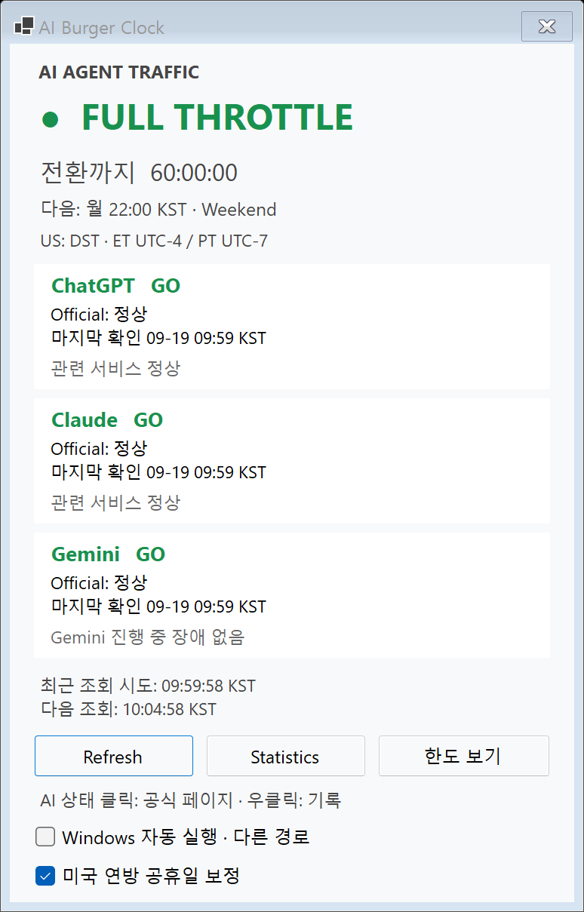
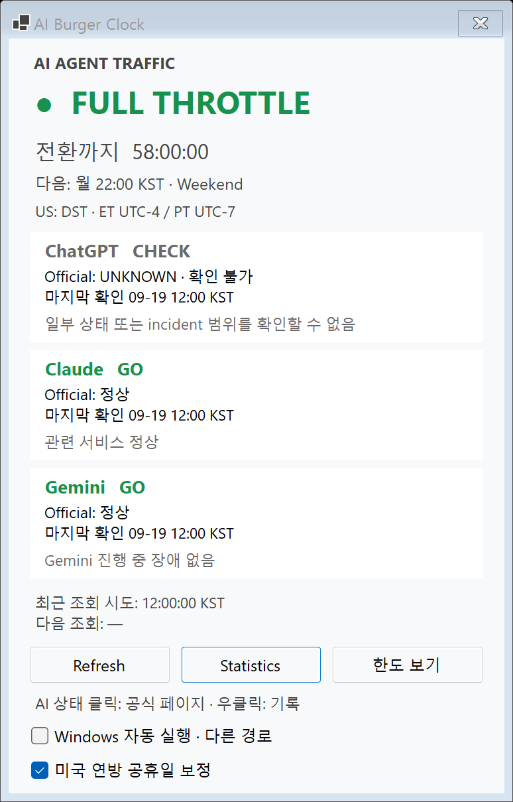
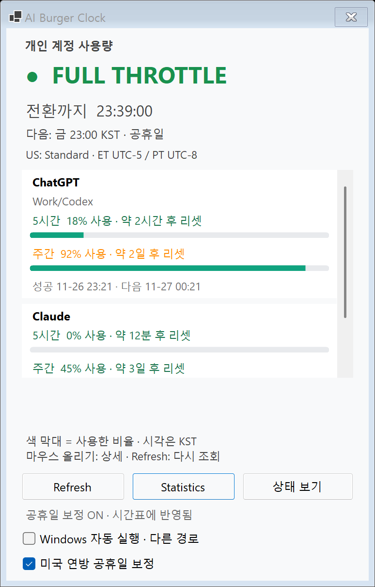

# AI Burger Clock 2.4.1 — Windows 공식 상태 판정 배포 기록

기록일: **2026-10-10 KST**. 상태: **#49 승인·main 병합·Windows 2.4.1 배포·최종 확인 완료**.

Mac 확인이 끝난 #48을 병합한 main `b5461ec`에서 `feature/windows-release-2-4-1`을 만들고, 버전·기록·합성 PNG만 바꾼 준비 PR [#49](https://github.com/hydron75/ai-burger-clock/pull/49)를 검증했다. 사용자가 #49 병합·교체를 승인한 뒤 Draft를 해제하고 승인 HEAD `3ab1854`를 지정해 병합했다. main에서 `git pull --ff-only` 후 **깨끗한 병합 main `0d69a64`를 최종 EXE 소스**로 사용했다.

**정상 종료 → 프로세스·WAL/SHM 부재 확인 → 2.4.0 백업·해시 검증 → `build.ps1 -Publish` → 최종 단일 EXE 검사 → 새 2.4.1 일반 실행**을 완료했다. 최종 FileVersion **2.4.1.0**, self-test **251,547건·ExitCode 0**, smoke **394 PASS·ExitCode 0**이다. 같은 자동 시작 경로가 새 EXE를 가리킨다. 공개 상태 probe에서 ChatGPT는 **범위 미확인 UNKNOWN / CHECK이며 STALE가 아님**을 확인했고, 실제 트레이·상태 창·ChatGPT 카드 정상은 **사용자 확인**이다. 문제·복원 없이 새 배포본을 실행한 상태로 유지한다.

## 버전과 변경 범위

Version **2.4.1**, AssemblyVersion·FileVersion **2.4.1.0**이다. Windows 11 x64 / WinForms / net10.0-windows / framework-dependent 단일 EXE와 .NET 10 Desktop Runtime x64 요구사항을 유지한다.

배포 2.4.0 소스 `296f52492de8e0529df853b2e06a7640887ccc03` 이후 Windows에 적용되는 동작 변경은 #48이다. 그 사이 `8f9a30d`는 2.4.0 배포 기록이며 새 제품 동작이 아니다.

| 항목 | 2.4.0 이후 Windows 변경 (#48) |
|---|---|
| OpenAI 구성 요소 | `summary.json`에 `components.json`의 누락 항목을 보완. Codex Web/API/CLI·VS Code extension을 포함하며, 서로 다른 응답의 정상 값이 확인된 장애를 지우지 못하게 함 |
| 응답 수신과 판정 | 필수 HTTP 응답과 제한된 본문 수신이 완료되면 마지막 확인 시각을 갱신. 범위 판정 불가를 수신 실패로 처리하지 않음. 수신 성공은 GO·서버 데이터 최신성 보증이 아님 |
| 범위 미확인 사건 | 확인된 관련 장애와 별도 보관·표시. 이것만 있으면 FULL에서 UNKNOWN / CHECK. 확인된 성능 저하·장애는 기존 HOLD / STOP이 우선. 무조건 GO로 바꾸지 않음 |
| STALE | 수신 실패는 확인 시각을 갱신하지 않으며 마지막 수신 뒤 15분 경과 시 STALE / CHECK. 이전 장애 제목을 현재 장애처럼 카드에 남기지 않음 |
| 카드·Tooltip | 카드에 마지막 확인 시각. Tooltip에 현재 판정·수신/판정 실패·과거 판정 상태·범위 미확인 사건을 구분. 과거 시각이 없으면 `(시각 미상)`, 중복 사유·같은 시각 반복은 생략 |
| 저장 | SQLite schema 2와 기존 기록 유지. 공식 상태 보조 진단을 Provider별 최대 8KiB의 `AppMetadata` JSON 한 건으로 추가. 캐시 시각과 맞는 유효한 진단만 읽음 |
| Windows 배치 | 상태 카드의 확인 시각 한 줄로 창 높이 **518→569 DIP(+51)**, 폭 **374 DIP**. 한도↔상태 전환과 Provider별 한도 박스·막대·상세 동작 유지 |

공개 구성 요소 관련 목록·출처·판정 기준은 [PROVIDER_SOURCES](PROVIDER_SOURCES.md)에 있다. **Atom/RSS 대조·공개 위젯·HTML scraping·비공개 endpoint는 추가하지 않았다.** 계정 한도 CLI·조회 정책·시간표·공휴일·트레이 알림 규칙·기록·통계·자동 시작은 이번에 추가 변경하지 않는다.

#48의 공통 C#는 Windows 및 [Mac 최종 확인](https://github.com/hydron75/ai-burger-clock/pull/48#issuecomment-6095764419)을 거쳐 병합됐다. Mac은 HEAD `8c141c6`에서 SDK 10.0.401 / Xcode 27.0, 공통 251,240건, 빌드 경고 0·오류 0, native smoke 종료 코드 0을 기록했다. #49와 이번 배포 기록의 범위는 **Windows만 변경 + 기록 문서**이며 공통 원본 27개·Mac/·MACOS_PORT.md·Mac 버전·AGENTS.md는 고치지 않았다. 위 Mac 결과는 이번 Windows 배포에서 새로 실행한 검사로 세지 않는다.

## 변경 파일

기존 수정:

- AiBurgerClock.csproj: Version / AssemblyVersion / FileVersion을 함께 변경.
- README.md·CODE_GUIDE.md·BACKLOG.md: 2.4.1 준비 상태·검사·사용법·기록 연결. 기존 2.4.0 실제 배포 기록과 보류 후보 유지.
- 배포 뒤 이 문서와 위 세 문서의 준비/승인 대기 표시를 실제 결과로 갱신. PROVIDER_SOURCES.md의 미배포 설명도 Windows 2.4.1 반영 완료로 갱신. 제품·검사 C#는 추가 변경하지 않음.

신규:

- MAINTENANCE_2_4_1.md: 변경 범위·준비 검증·Git 기준점·교체/복원 계획.
- docs/reviews/windows-release-2.4.1-20261010/의 상태 2장·한도 1장. 모두 **합성 데이터**이며 실제 계정 화면이 아니다.

소스 지도는 루트·Properties **72개(기능 38 + 검사·진단 33 + 명찰 1)**, Mac 호스트 7개, 공통 검사 입구 1개로 총 80개다. 이번 준비가 C# 파일이나 직접 패키지 의존성을 추가한 것은 아니다.

## 배포 준비: 빌드와 자체 검사

.NET SDK **10.0.401**. 실제 검증한 코드 HEAD는 `3d230ed0cbb30be9c1e9dcbec389a831a0c03682`이다. `build.ps1`을 실행해 **경고 0 / 오류 0**, Windows 자체 검사 **251,547 assertions / 실제 ExitCode 0**을 확인했다. 기존 dist 2.4.0도 `--self-test`를 실행해 **251,451 assertions / 실제 ExitCode 0**을 확인했다. 두 결과 모두 `Start-Process -Wait -PassThru`의 실제 ExitCode로 확인했으며 `$LASTEXITCODE`로 대신하지 않았다.

| 검사 그룹 | 기존 dist 2.4.0 | 후보 2.4.1 | 차이 |
|---|---:|---:|---:|
| official sources (in-memory HTTP) | 96 | 130 | +34 |
| service monitor/notification policy | 119 | 135 | +16 |
| SQLite/measurements/statistics/10,000 rows | 132 | 160 | +28 |
| panel text/tones | 261 | 279 | +18 |
| 나머지 공통 검사 | 250,536 | 250,536 | 0 |
| **공통 합계** | **251,144** | **251,240** | **+96** |
| **Windows 전용** | **307** | **307** | **0** |
| **전체** | **251,451** | **251,547** | **+96** |

감소한 그룹은 없다. 증가분은 #48에서 이미 추가한 검사이며 이번 버전 변경으로 늘어난 것은 아니다. Windows 307건은 자동 시작 229 + 트레이 픽셀/표시 이름 44 + Windows CLI 경로 3 + 경고 로그 31이다. 공통 251,240건은 Windows SelfTest가 SharedTestSuite를 한 번 실행한 결과이며 이번에 Shared.Tests를 별도로 실행하지 않았다.

## 배포 준비: smoke 5회와 합성 화면

기존 2.4.0 앱은 조작 도구에 종료 메뉴가 노출되지 않아 사용자가 정상 종료했다. 실제 프로세스 부재를 확인한 뒤 후보 Release EXE의 `--smoke-test --report-directory`를 **5회 순차 실행**했다. 임시 DB·가짜 HTTP/CLI·실제 WinForms 메시지 루프를 사용했고 `--verify-autostart`는 실행하지 않았다. 실패 제외·숨긴 재시도·대기 시간 증가 없이 회차별 stdout/stderr·PNG와 결과를 보존했다.

| 회차 | 실제 ExitCode | smoke PASS | FAIL | 소요 시간 |
|---|---:|---:|---:|---:|
| 1 | 0 | 394 | 0 | 32.10초 |
| 2 | 0 | 394 | 0 | 32.16초 |
| 3 | 0 | 394 | 0 | 32.84초 |
| 4 | 0 | 394 | 0 | 32.44초 |
| 5 | 0 | 394 | 0 | 32.87초 |
| **실패** | **0/5회** | | | |

- 상태·통계·공휴일·트레이 알림 요청·한도·기록·메모 잘림·막대·Provider 상세 검사가 통과했다. #48의 수신 성공/범위 미확인 CHECK 카드와 확인 시각, 과거 장애를 현재 카드에서 제거하는 연결 검사도 포함한다.
- 기존 2.4.0 배포 기록의 smoke 387건보다 **+7**이다. 이번 준비에서 2.4.0 smoke를 새로 실행한 결과는 아니며 #48에서 추가한 UI 검사와 렌더 항목이다.
- 합성 Gemini 10초 지연은 **10.02~10.05초**, UI heartbeat는 매회 **49회**, 트레이·상태 카운트다운 각각 **11~12종**이었다. 조회 대기 중 메뉴 열기·창 숨김/재열기·다른 Provider 독립 완료·중복 조회 없음이 통과했다. 실제 agy 장기 동작 보장은 아니다.
- BalloonTipShown은 매회 **19회**다. native 이벤트 관측이며 실제 배너 전체의 시각적 노출 확인은 아니다.
- 첫 회 PNG **20개 모두 #48 최신 Windows 검증 PNG와 SHA-256이 동일**하다. 정상 상태·범위 미확인 CHECK·한도 막대 이미지를 직접 열어 확인했다. 2.4.0과의 전체 이미지 비교를 이번에 새로 수행한 것은 아니며 창 높이·확인 시각 변화는 #48의 의도한 변경이다.
- 초기 뜻밖의 한도 모드의 원인은 여전히 미확정이며 SmokeDiagnostics와 BACKLOG 관찰을 유지한다. 이번 실패 0/5회가 초기 원인 확정·해결 보장은 아니다. stderr에는 정상 `DIAG:`도 남으므로 오류 파일이 비었다고 적지 않는다.

## 배포 준비: 실제 공개 상태 조회

후보의 `--check-providers`를 **2026-10-10 17:46 KST**에 실행해 **실제 ExitCode 0**을 확인했다. 계정 한도·CLI·사용자 DB가 아닌 공개 공식 상태만 조회했다.

| Provider | 실제 관측 |
|---|---|
| OpenAI / ChatGPT | summary + components 응답 수신 성공. 확인 시각과 수신 성공 시각이 일치. 범위 미확인 사건은 별도 필드에 남고 확인된 장애 필드는 비어 있음. UNKNOWN / FULL에서 CHECK이며 STALE가 아님 |
| Claude | 응답 수신 성공·관련 서비스 OPERATIONAL / FULL에서 GO. 전체 공지는 선택한 범위 외로 판정 |
| Gemini | 응답 수신 성공·선택한 Gemini 제품에 진행 중 장애 없음, OPERATIONAL / FULL에서 GO |

`--check-providers` 종료 코드 0은 필요한 응답 수신이 모두 성공했다는 뜻이며 **세 Provider 모두 GO·서버 자료의 신선도·실제 작업 성공을 보증하지 않는다.** 위 실제 관측을 정상 합성 이미지와 혼동하지 않는다. 실제 계정의 요금제·사용률·리셋 시각·식별자·CLI 원문은 공개하지 않는다.

로컬 증거는 ignored `artifacts/release-2.4.1-preparation-20261010/`의 build.txt, self-test.txt·self-test-errors.txt, dist-2.4.0-self-test.txt·errors, providers.txt·providers-errors.txt, smoke/run-01~run-05의 smoke.txt·smoke-errors.txt·render/*.png, smoke-results.csv이다. 원본 로그·DB·manifest·배포 EXE는 GitHub에 올리지 않는다.

## Git 기준점과 실행 파일

| 기준 | 전체 커밋 해시 / 상태 |
|---|---|
| 기존 배포 2.4.0 EXE 소스 | `296f52492de8e0529df853b2e06a7640887ccc03` |
| 이번 작업 전 main / 2.4.0 배포 기록 | `8f9a30d7ec5df56d195e00f80be94afe41372eb8` |
| #48 최종 HEAD / Mac 최종 확인 | `8c141c620316cd81c109fd1a747b4351a347566a` |
| #48 main 병합 / 준비 브랜치 출발점 | `b5461ec66664cb616ae017a469da7cbf973ccaf5` |
| 버전 변경 / 실제 검증한 코드 HEAD | `3d230ed0cbb30be9c1e9dcbec389a831a0c03682` |
| #49 승인·병합 대상 HEAD | `3ab1854dc9cd9c308916f1f68b1580f5aa434ad7` |
| #49 main 병합 / 최종 배포 EXE 소스 | **`0d69a64f5cb337be57add9be1036fca923330d4f`** |
| 최종 EXE 생성 뒤 변경 | 배포 결과를 적는 Markdown 5개만 변경. 이 후속 문서 커밋을 EXE 소스로 적거나 다시 publish하지 않음 |

| 항목 | 최종 배포 2.4.1 | 교체된 기존 2.4.0 |
|---|---|---|
| 경로 | dist/win-x64/AI Burger Clock.exe | 백업의 replaced-2.4.0.exe |
| FileVersion | `2.4.1.0` | `2.4.0.0` |
| ProductVersion | `2.4.1+0d69a64f5cb337be57add9be1036fca923330d4f` | `2.4.0+296f52492de8e0529df853b2e06a7640887ccc03` |
| 크기 | **3,392,747 bytes** | 3,339,499 bytes |
| SHA-256 | **`E610CD39DB17EBDC48EC7A6E0349B2A2B2993DEBE4DE555E41F6E1C10FE104D1`** | `DBA33333B2BD41DD87C223D0F9305672F31E8E51296B7E0998F7539515347500` |

최종 EXE의 절대 경로는 `C:/Users/mc_bl/.codex/.chatgpt-projects/g-p-6aa5eb198fd88191b7382af0eb114af4/AiBurgerClock/dist/win-x64/AI Burger Clock.exe`다. 준비 때의 bin 후보는 163,328 bytes·SHA-256 `DC4C303210FFABE0FBB96C1F00C9B40EB93DAEBEA7691DC68EDF7B457B4290B4`인 apphost이며 **최종 단일 EXE가 아니다.** 이를 dist로 복사하지 않고 병합 main에서 publish했다.

## 실제 백업·교체와 최종 검증

사용자가 승인한 교체 계획을 아래 순서로 실행했다. 준비 때 종료한 사실로 교체 시점의 종료/WAL 확인을 대신하지 않았다.

1. **18:10:13 KST**: #49 Draft를 해제하고 승인 HEAD를 지정해 병합했다. main에서 `git pull --ff-only` 후 `0d69a64`와 깨끗한 작업 트리를 확인했다.
2. 기존 2.4.0 앱은 조작 도구에 종료 메뉴가 노출되지 않아 **사용자가 트레이에서 정상 종료**했다. **18:13:29 KST**와 백업 직전에 실제 앱 프로세스 0개, DB 존재, burgerclock.db-wal·shm 부재를 확인했다. 강제 종료·WAL 삭제·DB 내용 조회는 하지 않았다.
3. **18:17:38 KST**: 새 폴더 **`../backups/release-2.4.1-20261010/`**에 기존 dist·EXE·실제 2.4.0 소스·닫힌 DB를 보관했다. 원본/복사본 해시 및 ZIP 안 EXE 해시가 일치했고, 백업 중 프로세스·WAL 부재와 DB 해시 불변을 다시 확인했다. 기존 백업은 덮어쓰지 않았다.
4. 승인된 **병합 main에서 `build.ps1 -Publish`**를 실행했다. SDK **10.0.401**, `dotnet build -warnaserror` **경고 0·오류 0**, publish 성공이다. 최종 dist의 **self-test 251,547건(공통 251,240 + Windows 307), 실제 ExitCode 0**을 확인했다. 준비 대비 증감 0, 기존 2.4.0 대비 +96이다.
5. 같은 최종 dist의 `--smoke-test --report-directory`를 **별도 1회** 실행해 **394 PASS / FAIL 0 / 실제 ExitCode 0 / 32.71초**를 확인했다. 준비 5회와 별도 결과다. 상태·통계·공휴일·한도·막대/상세·메모·트레이 요청과 범위 미확인 CHECK/확인 시각이 통과했다. 합성 Gemini 지연 **10.03초**, heartbeat **49회**, 트레이·상태 카운트다운 각각 **12종**, BalloonTipShown **19회**다. 실제 배너 노출과 혼동하지 않는다. 합성 범위 미확인 PNG도 직접 열어 확인했다.
6. **18:20:02 KST**: 최종 dist의 `--check-providers`를 실행해 **실제 ExitCode 0**을 확인했다. ChatGPT는 summary + components **응답 수신 성공**, 범위 미확인 사건은 별도 필드에 남고 확인된 장애 필드는 비어 있으며 **UNKNOWN / FULL에서 CHECK, STALE가 아님**이다. Claude·Gemini는 **관련 범위 OPERATIONAL / FULL에서 GO**다. 공개 HTTP 상태만 조회했으며 계정 한도·CLI probe나 사용자 DB 조회는 하지 않았다. 수신 성공은 서비스 정상·서버 데이터 최신성 보증이 아니다.
7. 자동 시작을 **읽기 전용**으로 전후·일반 실행 뒤 비교했다. HKCU Run `AI Burger Clock`은 `String`, 명령은 **같은 절대 dist EXE 경로를 큰따옴표로 감싼 값 + `--autostart`**다. StartupApproved/Run은 `Binary`, `020000000000000000000000`으로 모두 동일하다. 그 경로의 파일은 최종 2.4.1 버전·해시와 일치한다. 등록 변경·`--verify-autostart`·체크박스 조작은 하지 않았다.
8. **18:20:02 KST**: 새 dist를 `--autostart`로 일반 실행했다. **18:22:25 KST** 최종 확인에서 앱 한 개·최종 dist 경로·`Responding=True`·동일 버전/해시를 확인했다. 조작 도구에는 실제 트레이·창이 노출되지 않아 사용자에게 최종 화면 확인을 요청했고, **트레이·상태 창·ChatGPT가 STALE 아닌 판정 기준대로 표시되는지 정상으로 확인**받았다. 실제 계정 값·캡처는 받거나 게시하지 않았다.

백업의 절대 경로는 `C:/Users/mc_bl/.codex/.chatgpt-projects/g-p-6aa5eb198fd88191b7382af0eb114af4/backups/release-2.4.1-20261010/`다.

| 보관 파일 | SHA-256 / 확인 |
|---|---|
| replaced-2.4.0.exe | `DBA33333B2BD41DD87C223D0F9305672F31E8E51296B7E0998F7539515347500` — 교체 전 원본 및 dist ZIP 안 EXE와 일치 |
| dist-2.4.0.zip | `ED1BC3509D1FC4E730CAE40133C389886DB87ED03DEB13519163031EEB1C220D` |
| source-2.4.0-296f524.zip | `C0DDD8813EF0110A9D38F63949C1572596E8F088D9E9A24F1A6BB41FEFD93DA3` — 기존 EXE 소스의 git archive |
| burgerclock.db | `189FD5EB2368A644A076BF276138081666E49B2C08C7B28D9137B08B05EC2964` — 종료 직후 원본/복사본 일치, 내용 조회 없음 |
| published-2.4.1.exe | `E610CD39DB17EBDC48EC7A6E0349B2A2B2993DEBE4DE555E41F6E1C10FE104D1` — 최종 dist와 일치 |

교체 전·검증 뒤·일반 실행 뒤 manifest와 공개 상태 probe manifest도 같은 백업에 보관했다. **DB·EXE·manifest·원본 로그는 GitHub에 올리지 않는다.** 최종 로컬 증거는 ignored `artifacts/release-2.4.1-deployment-20261010/`의 publish-build.txt·publish.txt, final-self-test.txt·errors, final-smoke/smoke.txt·smoke-errors.txt·PNG, final-providers.txt·errors, backup-before.json·validation.json·final-public-probe.json·normal-launch.json·completion.json이다. 정상 실행 전까지 사용자 DB 해시 불변과 WAL 부재를 확인했지만, 일반 실행의 정상 조회가 캐시를 갱신할 수 있으므로 **전체 배포 과정에서 DB가 무변경이었다고 주장하지 않는다.**

## 2.4.0으로 되돌리기

교체 후 문제가 생기면 새 앱을 정상 종료하고 프로세스/WAL 상태를 확인한다. 교체 이후의 현재 DB를 별도로 보존하고 WAL·로그·기록을 삭제하지 않는다. 새 release 백업의 `replaced-2.4.0.exe` 또는 dist ZIP에서 원래 dist 경로로 **EXE만 복원**한다. FileVersion **2.4.0.0**와 위 2.4.0 SHA-256을 확인한 뒤 `--autostart`로 실행하고 등록 종류/값과 트레이·창을 확인한다.

#48은 SQLite schema 2·기존 기록·계정 한도 캐시 형식을 유지하지만 **공식 상태 보조 진단 JSON은 새로 추가**한다. 2.4.0은 이 별도 metadata를 무시하므로 EXE만 되돌리는 구조를 유지한다. 다만 2.4.0은 응답 수신과 판정 성공을 분리한 새 의미를 알지 못해, 새 캐시의 수신 시각을 과거의 상태 확인 시각처럼 표시할 수 있다. **기존 OpenAI 판정·STALE·표시 동작으로 돌아가는 제한**이 있으며 정상화된 상태를 보장하는 복원은 아니다.

백업 시점 DB로 덮어써 교체 이후 기록을 잃게 하지 않는다. DB 복원이 따로 필요하면 현재 데이터를 보존하고 범위·유실 위험을 설명한 뒤 승인받는다. 실제 2.4.0 복원 시험은 **미수행**이다.

## 이번에 수행하지 않은 항목과 종료 상태

- #49 병합·release 백업·교체 직전 WAL 검사·publish·최종 단일 EXE 검사·2.4.1 배포·자동 시작 경로 비교·트레이/상태 창/ChatGPT 카드 사용자 확인: **완료**. 실제 2.4.0 복원 시험은 **미수행**, 복원도 적용하지 않음.
- 새 2.4.1의 별도 실제 계정 한도 probe·실계정 한도 화면 확인·장시간 자동 조회·실제 배너 노출·재부팅/재로그인 자동 시작·절전 복귀·전체 네트워크 단절/재연결·실제 다중 모니터/DPI 전환: **미수행**. 이전 버전·합성 검사 결과를 새 실기 확인으로 옮겨 적지 않음.
- 이번 Windows 배포의 Mac 빌드/native smoke·별도 Shared.Tests: **미수행**. 이번 PR과 배포 기록은 공통 C#와 Mac 파일을 바꾸지 않았고 #48의 기존 Mac 확인은 별도 기록.
- Atom/RSS 대조·서버 데이터 원래 갱신 시각·신선도 입증: **미수행**. 응답 수신 성공과 구분함.

**현재 실행 중인 앱은 최종 2.4.1 dist다.** Run·StartupApproved 종류/값은 그대로이며 강제 종료·등록 변경·DB 복원은 하지 않았다. 후속 문서 커밋과 최종 EXE 소스 `0d69a64`를 구분하고, 배포 EXE·백업·실제 계정 값은 공개 저장소에 올리지 않는다.
