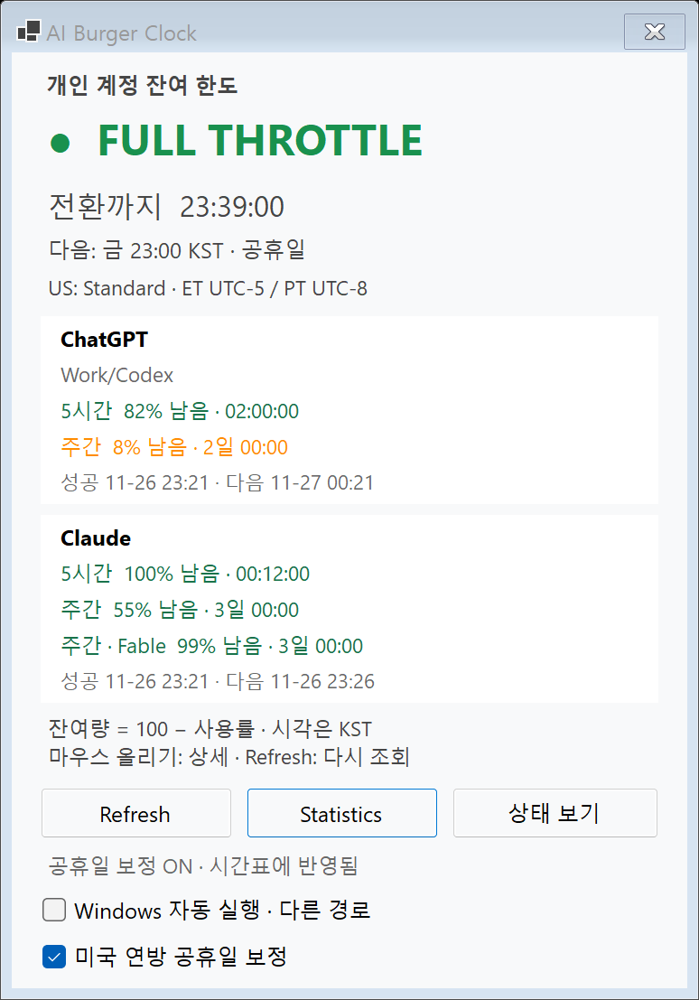
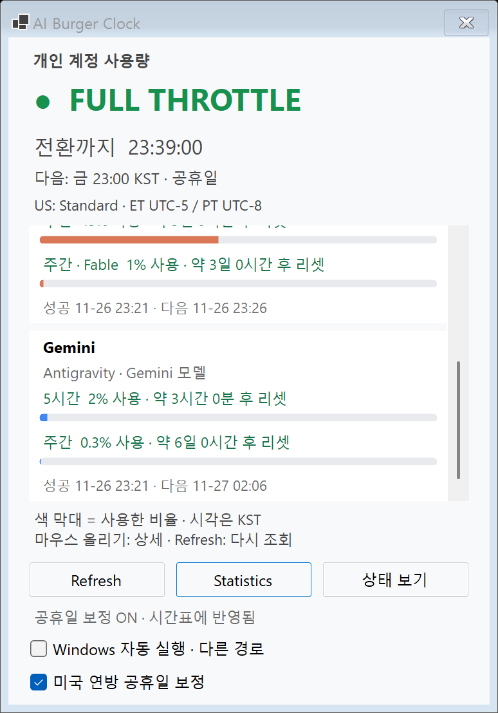
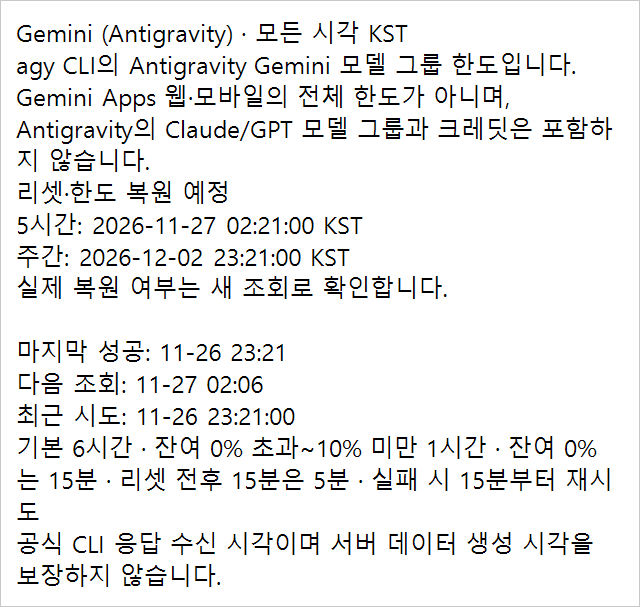

# 계정 사용량 표시·Provider 상세 공통화 — 배포 전 검증

기록일: 2026-10-10 KST. 범위: **공통 코드 변경**.

Windows 테스트 빌드의 사용량 막대·간략 시간·Provider별 상세 설명을 정리했습니다. Mac 소스·버전·MACOS_PORT.md·배포 EXE는 수정하지 않았습니다. **Mac 검증 전 병합하지 않으며, 이 작업은 배포 승인이나 버전 변경이 아닙니다.**

## 공개 기록의 계정 정보 보호

- [AGENTS.md](AGENTS.md#공개-저장소-계정-정보-보호)에 양쪽 담당의 공개 기록 규칙을 추가했습니다. 실제 계정의 요금제·사용률·리셋 시각·식별자는 PR 본문·코멘트·문서·첨부에 게시하지 않습니다.
- 이 문서와 PR의 화면 예시는 실제 계정과 무관한 **합성 데이터**입니다. `docs/images/quota-usage/` 4개와 `docs/reviews/windows-quota-tooltip-wrap-20261010/` 3개, PNG 7개 모두 테스트의 가짜 조회 응답과 주입 시각을 사용합니다. 이후 Mac 검증 코멘트도 합성 화면 또는 성공 여부·응답 형식 등 일반화한 결과로 남깁니다.
- 이번 추가는 지침·문서만 변경하며 앱 코드·검사 데이터·기존 빌드 결과는 바꾸지 않습니다.

## 표시 계약

- 제목은 `개인 계정 사용량`, 행과 막대는 **사용한 비율**입니다. 0%는 빈 막대, 100%는 가득 찬 막대입니다. 행은 소수 한 자리로 표시하되 막대 데이터는 원래 소수 사용률을 유지합니다.
- 5시간 창(`WindowMinutes=300`)은 `약 N시간 N분 후 리셋`, 주간 창(`10080`)은 `약 N일 N시간 후 리셋`입니다. 마지막 표시 단위를 올림하고 60분/24시간을 이월합니다. 한 시간/하루 미만에도 두 단위를 유지합니다.
- 주기 미확인 창은 남은 기간에 따라 단위를 정합니다. 1분 미만은 `곧 리셋 예정`, null은 `리셋 미제공`, 경과값은 `갱신 대기`입니다. 경과만으로 사용량을 0%로 바꾸지 않습니다.
- 상세는 **Provider별 하나**입니다. 모든 창의 정확한 `yyyy-MM-dd HH:mm:ss KST` 리셋 예정 시각, 미제공·경과 안내, 마지막 성공·다음 조회·최근 시도, 오류·캐시 오류, 조회 주기와 신선도 한계, 조회 범위를 담습니다. 화면에 이미 있는 사용률을 다시 나열하지 않습니다.
- 리셋은 예정 시각입니다. 실제 한도 복원은 새 조회로 확인합니다. 사용률 표시로 바꿔도 조회 주기·재시도·잔여량 기준 주의/위험 톤은 바뀌지 않습니다. DB·CLI·네트워크 조회 계약도 그대로입니다.

## 공통 원본 변경

| 파일 | 변경 |
|---|---|
| `QuotaPanelModel.cs` | 사용량 제목·행·안내, Provider 상세를 직접 생성. `QuotaLine.UsedPercent`는 실제 조회값 또는 null, `QuotaSectionText.Detail`은 Provider 상세. 제목·scope·행·metadata의 Detail은 동일 |
| `DisplayFormatting.cs` | `CompactResetCountdown`으로 간략 시간·올림·단위 선택을 공통화. 기존 `ResetCountdown`은 유지 |
| `PanelModelTests.cs` | 기존 골든을 새 표시 계약으로 갱신. 검사 수 261 그대로 |
| `QuotaPresentationTests.cs` / `SharedTestSuite.cs` | 시간 계산 14건을 Windows smoke에서 이동하고 새 계약 검사 39건 추가. 공통 실행 목록에 한 번 등록 |

새 앱 공통 파일은 추가하지 않아 `Shared/SharedSources.props` 목록은 그대로입니다. 새 검사 파일은 기존 glob으로 두 검사 프로젝트에서 컴파일합니다.

## Windows 네이티브 변경

- `AccountQuotaView.cs`: 공통 문구를 그대로 바인딩합니다. 사용률·시간·Provider 상세를 Windows에서 재계산하지 않습니다. scope의 접근성 상세도 매 갱신에서 최신 오류·시각으로 갱신합니다. 제목·하단 안내는 기존 `StatusWindow`의 공통 바인딩을 그대로 사용합니다.
- `QuotaBalanceBar.cs`: Windows 막대. ChatGPT `#10A37F`, Claude `#D97757`, Gemini `#4285F4`; 이전/경과 값은 회색입니다. Provider별 비클릭 박스와 상태↔한도 전환은 유지합니다.
- `QuotaDetailPopup.cs`: Windows 전용 비활성화 팝업. 흰색·320 DIP 고정 폭·줄바꿈·내용에 따른 높이·포인터 근처 배치·화면 경계 보정. 긴 상세는 세로 스크롤합니다. 포인터 감시, 벗어남·창 숨김·30초 만료 시 닫힘을 검사합니다.
- `AccountQuotaUiChecks.cs` / `QuotaToolTipUiChecks.cs`: 실제 WinForms 메시지 루프에서 화면·막대·색·공통 바인딩·접근성·툴팁 배치/닫힘/DPI·긴 상세·Refresh 응답성을 검사합니다.
- 창 크기는 그대로이고 막대로 늘어난 내용은 한도 영역 안에서 세로 스크롤합니다. 한도 박스에는 hover 효과나 클릭·기록 메뉴를 넣지 않습니다.

## Windows 검증

기준 main: `67ec31b13846c63a4c799a360cf232362209eb42`. Windows 테스트 표시 checkpoint: `49ce2cd`. 검증한 최종 C# 소스: `ca288d3446507fb2379748453c65577584695a62`와 같은 작업 트리이며, 이후 변경은 이 기록·합성 PNG와 BACKLOG뿐입니다.

- SDK **10.0.401**.
- `build.ps1`: `dotnet build -warnaserror`, 경고 **0** / 오류 **0**. 실제 EXE `--self-test` **251,430건, ExitCode 0**. 스크립트의 `Start-Process -Wait -PassThru` 결과로 확인했습니다.
- `dotnet run --project Shared.Tests/AiBurgerClock.Shared.Tests.csproj -c Release --property:TreatWarningsAsErrors=true`: 공통 **251,123건, 종료 코드 0**.
- 최종 Release EXE `--smoke-test --report-directory ...`: **387 PASS, ExitCode 0**. `Start-Process -Wait -PassThru`로 확인했습니다.
- 합성 Gemini 10초 대기 **10.02초**, UI heartbeat **48회**, 트레이·상태 카운트다운 각 **12개 값**. 메뉴 열기·창 숨김/재열기·다른 Provider 완료가 조회 대기 중에도 통과했습니다.
- 풍선 알림 이벤트 17건을 관측했지만 실제 사용자 화면에서 배너가 보였다는 보장은 아닙니다.
- `git diff --check` 통과. 통과한 smoke를 추가 반복하지 않았습니다.

### 검사 수 변화

| 검사 | main / 공통화 전 Windows 테스트 | 공통화 후 | 차이 |
|---|---:|---:|---:|
| 공통 자체 검사 | 251,070 | 251,123 | +53 |
| Windows 전용 자체 검사 | 307 | 307 | 0 |
| Windows self-test 전체 | 251,377 | 251,430 | +53 |
| 공통 panel text/tones 그룹 | 261 | 261 | 0, 기대 문구 갱신 |
| 새 quota usage/countdown/provider detail 그룹 | 0 | 53 | 이동 14 + 신규 39 |
| smoke PASS (공통화 전 테스트와 비교) | 397 | 387 | 순수 시간 검사 −14, 바인딩/접근성 +4 |

main 배포 소스의 기존 smoke는 293 PASS입니다. 397은 앞선 로컬 UI 테스트의 결과이지 main 결과가 아닙니다. 나머지 self-test 그룹 수는 변하지 않았습니다.

### 초기 실패와 수정

첫 smoke는 `Screen-reader row descriptions retain their original precise reset data: Codex`에서 ExitCode 1입니다. 검사에만 남은 예전 개별 상세의 `리셋:` 문자열 조건 때문입니다. 새로운 상세는 각 창 이름과 정확한 KST 시각을 Provider 단위로 제공합니다. 공통 골든에서 정확한 시각을 확인하고 Windows smoke도 행 접근성 설명이 Provider 상세와 같고 KST 리셋 안내를 포함하는지 확인하도록 갱신했습니다. 앱 대기 시간·조회 코드·클릭 판정은 변경하지 않았습니다.

로컬 증거: `artifacts/shared-quota-usage-20261010/`의 `build.txt`, `shared-test.txt`, `before/`, 실패 보존 `attempt-01/`, 최종 `after/`의 self-test·smoke stdout/stderr와 PNG. 실패 진단도 삭제하지 않습니다.

### 화면 비교

- 공통화 전 로컬 테스트 대비 PNG **19개 중 18개 SHA-256 동일**. Gemini 상세 하나만 범위 설명을 앞부분으로 옮겨 변경했습니다. 설명은 한 번만 나오며 내용은 같습니다.
- 기존 main 렌더 대비 상태·공휴일·Provider 장애·통계·기록·메모 안내 PNG **8개 SHA-256 동일**.
- 한도 화면은 main과 달라지는 것이 정상입니다. 아래 이미지는 실제 WinForms smoke의 **합성 계정 데이터**이며 사용자 계정값이 아닙니다. 새 한도와 상세 PNG를 직접 열어 줄바꿈·시각·막대를 확인했습니다.

변경 전 main:

변경 후 두 Provider:

변경 후 Gemini와 Provider 상세:

## Mac Claude에게 전달할 반영·검증 요청

이 PR은 공통 코드 변경입니다. **Mac 검증 코멘트가 나오기 전 병합하지 않습니다.** Windows 담당은 `Mac/`·Mac 버전·`MACOS_PORT.md`를 수정하지 않았습니다.

1. 이 PR HEAD를 받아 `Mac/build.sh`와 네이티브 `--smoke-test`를 실행하고, 커밋 해시·SDK/Xcode·경고/오류·공통 assertion 수·smoke 종료 코드를 PR 코멘트로 남겨 주세요. 공통 검사는 **251,123건(+53)**이 예상됩니다. 다르면 그룹별 차이를 알려 주세요.
2. 기존 `QuotaPanelModel.Sections` 호출에서 한도 행과 Detail이 자동으로 바뀝니다. 5시간/주간의 사용률·간략 단위, 정확한 KST 상세, 이전/경과/미제공·조회 실패 상태가 팝오버에 맞게 표시되는지 확인해 주세요. 기존 Mac smoke의 행·툴팁 기대값도 점검해 주세요.
3. Mac 제목은 지금 `개인 계정 잔여 한도`로 하드코딩되어 있습니다. Mac 후속 반영에서 `QuotaPanelModel.AccessibleName`을 사용해 `개인 계정 사용량`으로 맞춰 주세요.
4. Mac 후속 반영에서 `QuotaLine.UsedPercent`로 네이티브 사용량 막대를 추가해 주세요. 0% 빈 막대 / 100% 가득 찬 막대, 서비스별 대표색, 이전·경과 값은 Muted로 구분합니다. null에는 막대를 만들지 않습니다. 색·그리기·라이트/다크 대비는 AppKit에서 정합니다.
5. 상세 문구를 다시 만들지 말고 `QuotaSectionText.Detail`을 사용해 Provider별 하나로 정리해 주세요. 모든 행 Detail도 같은 값입니다. 사용률을 다시 나열하지 않고 정확한 리셋 예정 시각·실제 복원 확인 조건·조회 범위를 유지합니다.
6. 결정 9/10 유지: 제목 바깥 기준선, 같은 안쪽 여백의 Provider별 비클릭 박스, 한도 hover 없음, **Mac 한도 항상 표시**. Windows 전환 방식은 Mac에 넣지 않습니다. 작은 화면 스크롤·스크롤 위치 유지·추가 모델 행·라이트/다크를 확인해 주세요.
7. **Mac 툴팁의 정상적인 자동 크기·위치는 고칠 필요가 없습니다.** Windows의 고정 흰색·320 DIP·타이머/포인터 감시 코드를 이식하지 마세요. Mac 후속 UI는 Mac 담당 별도 브랜치/PR에서 진행하고, 적용할 수 없는 부분은 이유와 대안을 코멘트로 알려 주세요.

## 보존·미수행

- 배포 `dist/win-x64/AI Burger Clock.exe`: **2.3.0.0**, SHA-256 `69893DBF1E971DFDA10CDE8B72BC89F11982758AC49DCC0D46D6753FDBEAD513` 그대로입니다. publish·교체·버전 올리기는 하지 않았습니다.
- 사용자 DB·CLI 인증·자동 시작 등록을 테스트에서 변경하지 않았습니다. `--verify-autostart`·실제 계정 조회는 이번 검증에서 실행하지 않았습니다.
- Mac 빌드·native smoke, 실제 다중 모니터에서 사용자가 포인터를 움직이는 관찰, 실제 한도 리셋/복원, 재부팅·절전·전체 네트워크 단절 검사는 **미수행**입니다. DPI·음수 모니터 좌표·포인터/닫힘은 실제 Windows 팝업과 합성 좌표/이벤트로 검사했으며 실사용 관찰과 구분합니다.
